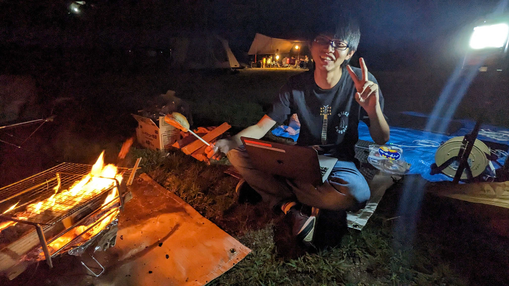
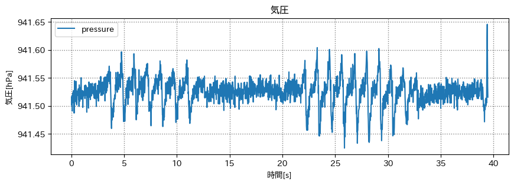

# キャンプ
今回、梶研かつシステム工学研究会の同級生と先輩の3人でキャンプに行ってきました。
先輩のキャンプセンシングという研究のために、キャンプのデータを取得することが目的です。

さらに 技育CAMP マンスリーハッカソン vol.9 を同時に開発しており、PCを開きながらのキャンプでした。

# センシング
キャンプが終わり、ブルーシートの水を飛ばしている時、面白いデータがとれそうだと思いました。
下にスマホを置いて気圧をとってみると、面白いデータがとれました。

## データ取得中の様子
<iframe width="560" height="315" src="https://www.youtube.com/embed/iwdSV1xFTPM?si=dKs9QrGhYdA8kY-r" title="YouTube video player" frameborder="0" allow="accelerometer; autoplay; clipboard-write; encrypted-media; gyroscope; picture-in-picture; web-share" allowfullscreen></iframe>

ふっと思いついたセンシングでしたが、どこかで遊べそうな良いデータをとれました。
