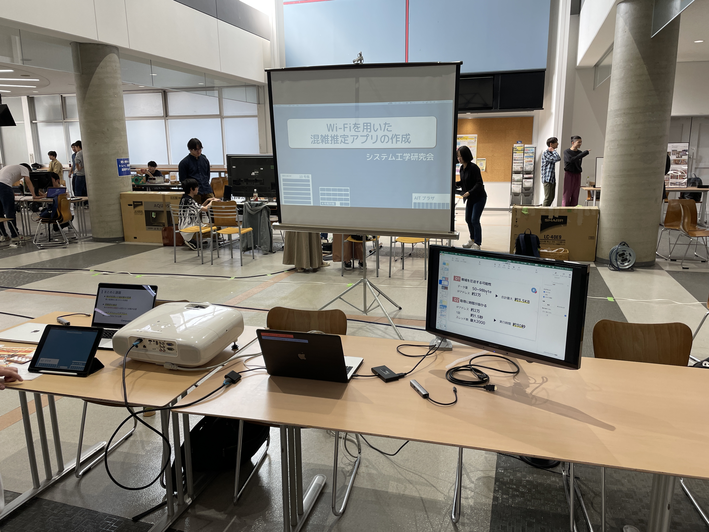
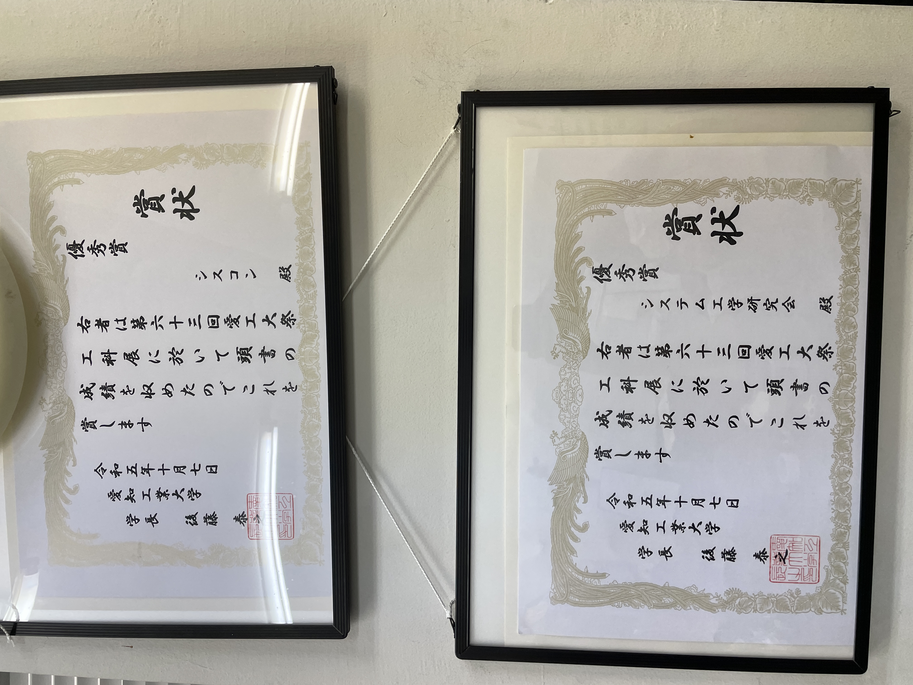

# 工科展
10月7,8日に工科展が行われました。
研究室やサークル, 学生チャレンジプロジェクトなどで制作した作品を展示するイベントで、
私たち チームシステム工学研究会 は **WiFiを用いた混雑推定アプリの制作** について展示・発表しました。

### 展示中の様子

# イベントを終えて
今回チームで開発するにあたり、プログラミングをあまりやったことがないメンバーも多く、
制作の役割分担と進行に苦労しました。

実際に展示していると、
> arpスキャン でよくない？
> ネットワーク圧迫しない？

などネットワークを専門とする方からの意見もありましたが、
 `ping` を選んだ理由など、あらかじめ対策をしており完璧に対応できたのが良かったです。

次出るのであれば、より精度を上げていきたいと思います。

# 制作した作品
`ping` を用いて各ネットワーク部に接続する端末数を取得し、
その情報をもとに混雑を推定するアプリを制作しました。

実際のアプリは [こちら](https://campuscrowdmonitor.vercel.app/) から見れます

### 発表スライド
<iframe src="https://docs.google.com/presentation/d/e/2PACX-1vTWiPglUQcwyxrfy1JpxFiuUqbi-u2zV1TS5q3okM0PAUag97G56OjMeV3Mm2vlT3iQiZyOwPDh8OSv/embed?start=false&loop=false&delayms=3000" frameborder="0" width="960" height="569" allowfullscreen="true" mozallowfullscreen="true" webkitallowfullscreen="true"></iframe>

# 賞について
研究室を含む5チーム中、優秀賞(2位) を頂きました。

### 賞状
上はもう一方のチームのもの

