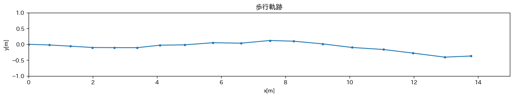

# スケジュール
- [x] 歩行軌跡の可視化
  - [x] データを取得する
  - [x] 加速度, 角速度をグラフ化
  - [x] 歩行軌跡を表示する
  - [x] 加速度の大きさに合わせて歩幅を変えてみる

# 進捗
## データを取得する
#### 使用機器等
- iPhone 12

### iOSアプリを制作
前回使用した phyphox は2つ以上のデータの取得ができなさそうだった  
(やり方あった)

charGPTに聞きながら作った

結局使わなかった

### 取得方法
腰にポーチを付けてスマホを入れた  
画面(z軸)を正面に、ジャイロのx軸左回りを正  

10歩 + 左90度 + 5歩

## 加速度, 角速度をグラフ化
#### 使用言語等
- Python 3.10.10
  - pandas
  - matplotlib
  - numpy
  - signal
  - itertools

### 加速度と角速度, 角度のグラフ

1歩を赤丸でプロット  
角速度を積分して角度を出した  

#### 条件
- 高さ 11m/s^2 以上
- 間隔 0.3s 以上(30サンプル)

## 歩行軌跡を表示する
### アルゴリズム
0歩の時点を (0, 0) とする  
1歩 70cm とする  
1歩進んだ時の角度(α)を出す  
α度の方向に70cm進んだ位置にプロット

### 歩行軌跡

形は想定通りだが、傾いているのが気になる  
→ 1歩踏み出した時点では腰が斜めになるから?

## 加速度の大きさに合わせて歩幅を変えてみる
5歩(歩く) + 5歩(早歩き) + 6歩(小走り)  

### 歩幅の計算
10m/s^2 : 60cm  
25m/s^2 : 100cm  
とし、一次関数として計算
> step = norm  * 0.027 + 0.33

### 歩行軌跡

分かりづらい...

#### 各歩幅(m)
> 0.648  
> 0.658  
> 0.683  
> 0.689  
> 0.709  
> 0.707  
> 0.774  
> 0.882  
> 0.875  
> 0.906  
> 0.736  
> 0.904  
> 0.929  
> 0.983  
> 0.925  
> 0.991  
> 0.816  

変化はしている  
(見やすいように少数第4位以下切り捨てしてある)

### 歩行軌跡2

5歩軽く + 7歩大きく  
大袈裟にしてみた。  

# メモ
### ジャイロセンサーの向き

### 積分
> arr = np.random.rand(100, 10)
> arr = np.cumsum(arr) / fs

fs はサンプリング周波数

### 微分
> arr = np.random.rand(100, 10)
> arr = np.diff(arr) * fs

## メモ
グラフタイトルに `X軸` などをしっかりかく  
グラフの範囲(時間)が揃えてあるのが良い  
歩行軌跡のグラフは歪ませてはいけない
(x軸を10m=>1cm なら y軸も10m=>1cm)

### 2乗誤差(RMSE)  
[PythonでRMSE](https://www.delftstack.com/ja/howto/python/rmse-python/)

- 誤差を出す
- 三次元の軌跡を出す
  - 二次元のグラフにする
  - Unityの3次元データにする

[kajilab.net](https://kajilab.net/kaji/)

> Ichikari, R. Kaji, K., Shimomura, R., Kourogi, M., Okuma, T., and Kurata, T.: Off-Site Indoor Localization Competitions Based on Measured Data in a Warehouse, Sensors 2019, Vol.19, Issue.4, No.763, 2019.

[MDPI](https://www.mdpi.com/1424-8220/19/4/763)

> Abe, M., Kaji, K., Hiroi, K., Kawaguchi, N. PIEM: Path Independent Evaluation Metric for Relative Localization, in Proceedings of the Seventh International Conference on Indoor Positioning and Indoor Navigation (IPIN2016), 2016.

[ACM](https://dl.acm.org/doi/abs/10.1145/3341162.3343765)

## 単語帳
### LiDAR(Light Detecton and Ranging)
なんか誤差がとても小さく、禁止されてしまったやつ
