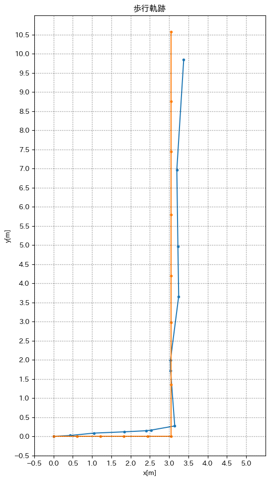

# スケジュール
- [ ] 二乗平均誤差(RMSE)を出す
  - [x] 計測
  - [x] グラフ化
  - [x] 二乗平均誤差を出す
  - [ ] 誤差を減らす
- [ ] 3次元の歩行軌跡
  - [ ] 計測
  - [ ] グラフ化

# 進捗
## 計測
5歩 + 90度左 + 8歩(大きく) + (3歩)

歩幅に合わせて合わせて目印をつけ、歩く

#### 実測した軌跡

#### 加速度, 角速度, 角度グラフ

1歩を赤丸でプロット  
角速度を積分して角度を出した  

#### ピークの条件
- 高さ 11m/s^2 以上
- 間隔 0.3s 以上(30サンプル)
- 顕著度(?)の閾値 3.5以上

> signal.find_peaks(df_acc['low_norm'], height=11, distance=30, prominence=3.5)

いい感じ...?

#### 軌跡

90度左向いたはずが明らかに無い  

## 原因
[角度のグラフ](#加速度-角速度-角度グラフ) をみてみると... `約6.2rad` => `約360度`    
(先週の記録は `約1.75rad`)

角速度を見てみると先週の約10倍  
角度を `*0.1` してみる

#### 軌跡(角度*0.1)

なぜ `*0.1` する必要があるかは分からない  
=> 反対に いくつ掛ければ90度になるか を考えてみる

#### 軌跡(角度*0.26)

ぐねぐねしてるけど理想はこんな感じ

`0.26` って何者...  
> 1 / 0.26 = 3.84

... 3.14?  
=> 弧度法と度数法の云々かと思ったけど違った

積分 & 値が大きくなる => サンプリング周波数?

計測時間 13.312s  
サンプル数 5445
> 13.312 / 5445 = 0.002444811754  

0.26 * 0.01 に似ている...

> 5445 / 13.312 = 409.02944711538

サンプリング周波数 `約400Hz`  
=> **iPhoneの100Hz のまま計算していた**

理想のグラフになった

#### 実際の軌跡も表示

大きくずれているがひとまず置いておく

## 二乗平均誤差を出してみる
#### 計算方法
各点同士の差の合計を点の数で割る
> √((x1 - x2)^2 + (y1 - y2)^2) / n

(TeX書けるようになりたいな...)

RMSE : `1.8939717262144389`  
=> 平均で 約1.89m の誤差

大きすぎる

## 誤差を減らしてみる
加速度(ノルム)をx軸, 実際の歩幅をy軸として散布図に描画

#### 歩幅と加速度の関係

全然きれいにならない(理想は一直線)  
=> あらかじめ付けた印に合わせて歩幅を変えたから?  

ひとまず無理やり一次関数にする  

#### 無理やり一次関数にしたグラフ

> step = 0.1 * norm - 0.5

この式を使って軌跡を描く

さすがに適当すぎた

#### 軌跡が一番ぽくなったグラフ

RMSE: `0.9968661661770276`  

軌跡はぽいが、一歩の位置が明らかにおかしい

#### RMSEが最小となったグラフ

RMSE: `0.7881589575527493`

> step = 0.269 * norm - 0.3.043

0.788 は大きすぎる...  
=> データの取り方を変える

普通に歩く -> 動画から歩幅を割り出す

## 誤差を減らす

# メモ
平滑化フィルター掛けたの書くこと  
計算方法は全て書くこと  

目的に応じた精度で  
今回はこれで十分  
=> 今後何か作るときに応じて

[xDR challenge](http://hasc.jp/ipsc/)

3次元のセンサーデータ  
[HASC-IPSC](http://hasc.jp/ipsc/)

## ハッカソン
非日常からアイデアを探すと被りにくい  
- 祭り
  - 金魚すくい

トイレットペーパーの回転から個人認識
- [IPSJ](https://ipsj-one.org/2019/)  
- [動画](https://ipsj-one.org/2019/videos/4_murao_fs.mp4)
