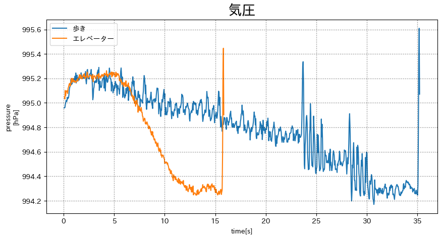
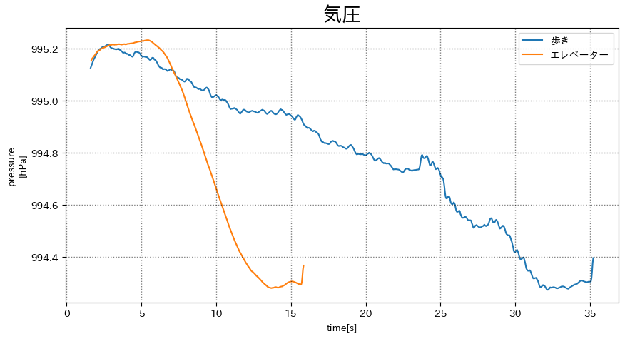
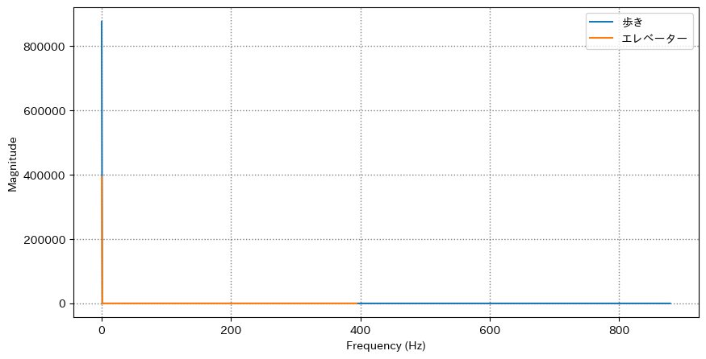
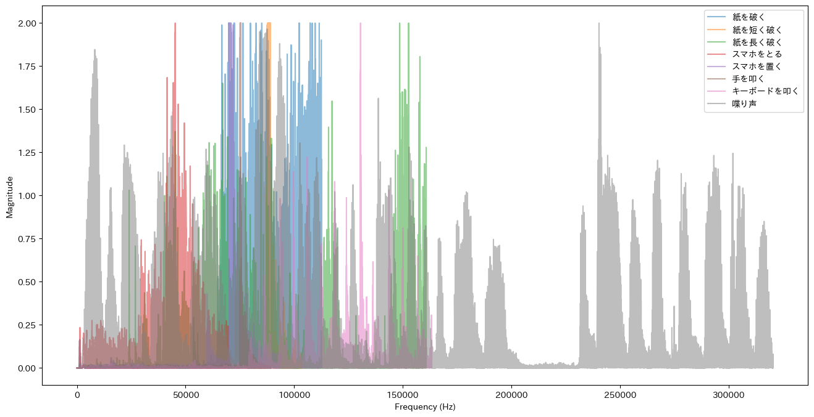
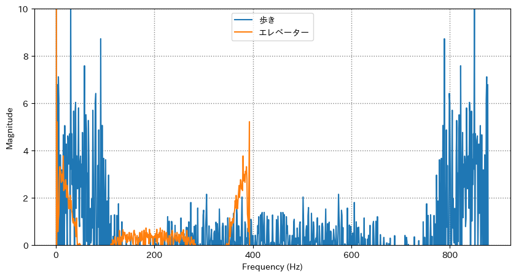
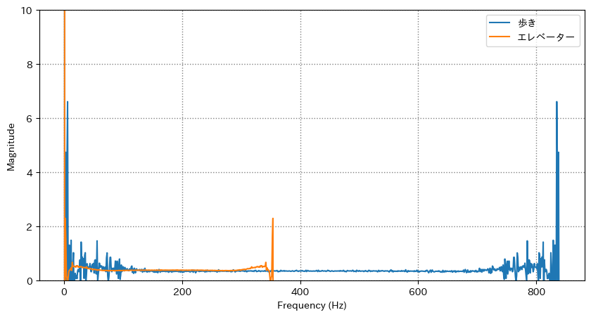

# スケジュール
## 短期的なスケジュール
- [x] 速度を変えてUnityでアニメーション
  - [x] データをとる
  - [x] アニメーションをつける
- [x] エレベーターと歩きを判別する
  - [x] データをとる
  - [x] グラフ化
  - [x] フーリエ変換
  - [ ] 判別する


# 進捗
## 速度を変えてUnityでアニメーション
#### 前回
<iframe width="560" height="315" src="https://www.youtube.com/embed/TBRMeLTtI4c" title="YouTube video player" frameborder="0" allow="accelerometer; autoplay; clipboard-write; encrypted-media; gyroscope; picture-in-picture; web-share" allowfullscreen></iframe>

速度差を再現したけど分からづらかった

### データをとる
### 場所
1号館 5階-7階  

### 取り方
- 腰にポーチをつける
- Pixel5 (Android)
- Pyphox
  - 気圧センサー
  - 加速度センサー
  - 角速度センサー

5-6階: 歩く(1段ずつ)  
6-7階: 走る(2段ずつ)


### 速度差をつけた動作のアニメーション
<iframe width="560" height="315" src="https://www.youtube.com/embed/F5FjcU7aoEg" title="YouTube video player" frameborder="0" allow="accelerometer; autoplay; clipboard-write; encrypted-media; gyroscope; picture-in-picture; web-share" allowfullscreen></iframe>

(実際の4倍速になっている)

速度に応じて歩幅も変わっている  
=> 加速度を元に歩幅を計算する

#### "二乗平均誤差(RMSE)を出す" で使用した式
> step = 0.1 * norm - 0.5


### 加速度を元に歩幅を変えたアニメーション
<iframe width="560" height="315" src="https://www.youtube.com/embed/Y3X-Se6wf5Q" title="YouTube video player" frameborder="0" allow="accelerometer; autoplay; clipboard-write; encrypted-media; gyroscope; picture-in-picture; web-share" allowfullscreen></iframe>

いい感じ  
進行方向を計算から求める

#### 進行方向の求め方

```c#
UnityEngine.Vector3 current = positions[currentIndex];  // 現在の座標  
UnityEngine.Vector3 next = positions[currentIndex + 1];  // 次の座標  

UnityEngine.Vector3 vector = next - current;

// 進行方向
float angleY = MathF.Atan2(vector.x, vector.z) * 180 / Mathf.PI;
```

### 進行方向を表示したアニメーション
<iframe width="560" height="315" src="https://www.youtube.com/embed/0tppOrTNaBs" title="YouTube video player" frameborder="0" allow="accelerometer; autoplay; clipboard-write; encrypted-media; gyroscope; picture-in-picture; web-share" allowfullscreen></iframe>

(移動ツールの矢印を表示している)

**いずれ** オブジェクト自体を変形させて進行方向をわかりやすくしたい


## エレベーターと歩きを判別する
### データをとる
### 場所
1号館 5階-7階  

### 取り方
- 腰にポーチをつける
- Pixel5 (Android)
- Pyphox
  - 気圧センサー
  - (加速度センサー)
  - (角速度センサー)

#### 気圧センサーの値


#### 移動平均フィルターをかけたもの


前後40サンプル(0.1s)


### エレベーターと徒歩の差 を出す方法
フーリエ変換する

#### フーリエ変換とは
> 異なる波数の波がどれくらい含んでいるかがわかる

=> 徒歩の場合は歩きの振動の周波数が現れる?

### フーリエ変換したグラフ


`0Hz` で盛り上がっているが他はほぼ 0  

原因
- フーリエ変換のやり方の問題
  - => 調べても間違ってはなさそう
- データの問題
  - => 別のデータで試してみる


### さまざまな音をフーリエ変換したグラフ


(ハッカソンに向けて)  

=> プログラムは合ってた  
`0Hz` が大きすぎて相対的に小さくなっている?


### 拡大したグラフ


`0 ~ 800000` => `0 ~ 10`

### 移動平均フィルターをかけたもの


前後40サンプル(0.1s)


# メモ
## エレベーターと徒歩の差
フーリエ変換(外山先輩より)

エレベーターと徒歩は気圧だけよりも、加速度などと組み合わせてやる  
歩いていないのに気圧さがっている  
=> エレベーター

一定間隔で区切って判定する  
=> スライド

1段飛ばしは難しい  
階段の場合は歩幅を定数でやると良い

フーリエの特徴的な点はスマホを取り出した時ので使えない  

`1.4Hz` あたりに特徴が出るのが理想
