# スケジュール
## 短期的なスケジュール
- [ ] エレベーターと歩きを判別する
  - [x] データをとる
  - [x] 歩いているかを判別する
  - [x] 上り下りしているかを判別する
  - [x] エレベーターと歩きを判別する
  - [x] 正解データと比較
  - [ ] 追加でデータとる
- [ ] 技育キャンプ ハッカソン
  - [x] テーマ決め
  - [x] 開発練習
  - [ ] 7/9 キックオフ
  - [ ] 7/16 本番

# エレベーターと歩きを判別する(続き)
## 変更点
### 上り下りしているかの判別方法
1秒ごとに区切り, 回帰直線を求める.  
参考: [スマートフォンを用いた階段利用判定](http://www.comm.tcu.ac.jp/cisj/15/assets/15_07.pdf)

傾きの絶対値が `0.012以上` の場合は上り下りしているとみなす(青色)  
`0.012未満` の場合は止まっているとみなす(黄色)  

#### 傾きの絶対値のグラフ
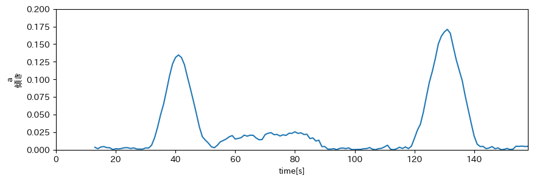

### 平滑化フィルター
`移動平均フィルター` ではなく `メディアンフィルター` を使用した.  
実際とのズレが縮まった

#### 気圧と判別結果
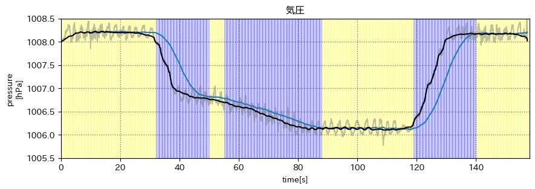

- 灰: 元データ
- 青: 移動平均フィルター(前後120サンプル)
- 黒: メディアンフィルター(前後120 + 1サンプル)

### 結果
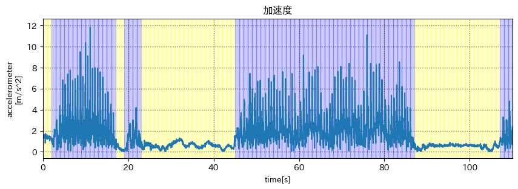
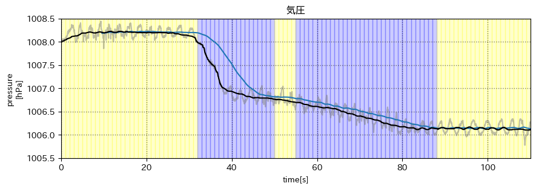

- 青: 歩いている || 上り下りしている
- 黄: 止まっている

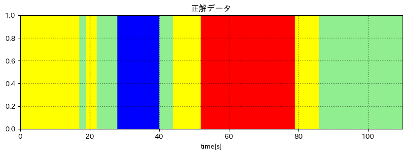

- 赤: 階段
- 青: エレベーター
- 黄: 歩行
- 緑: 待機

気圧と正解データを見比べると, エレベータを降りた後も  
上り下りしている判定になっている  
=> 傾いているから, プログラムではなくデータが悪い(?)  
=> エレベータを降りた時など, 一度止まるとよい

## より多くのデータ
### データ2
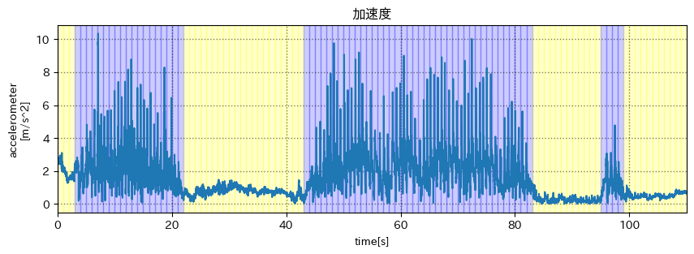
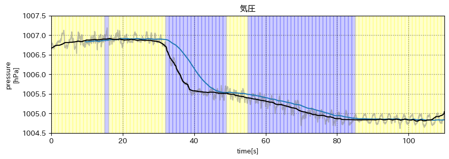

- 青: 歩いている || 上り下りしている
- 黄: 止まっている

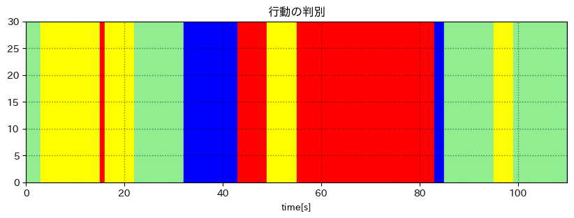
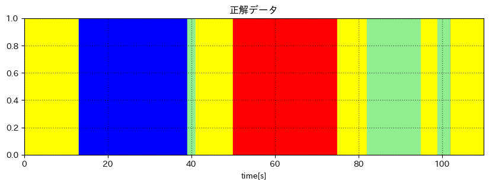

- 赤: 階段
- 青: エレベーター
- 黄: 歩行
- 緑: 待機

### データ3
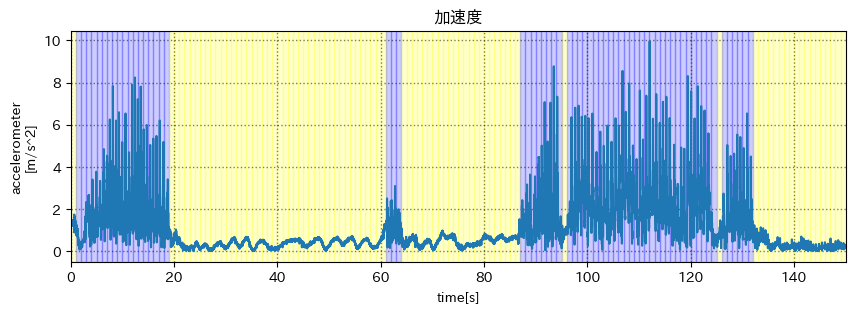
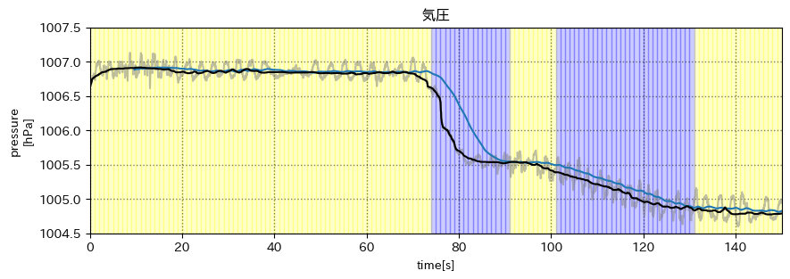

- 青: 歩いている || 上り下りしている
- 黄: 止まっている

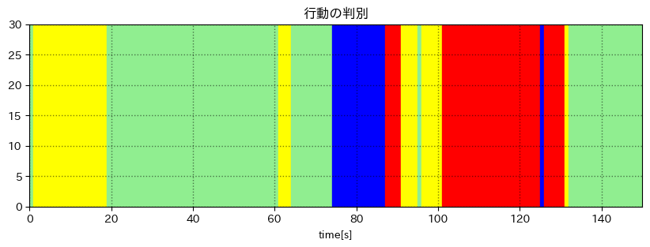
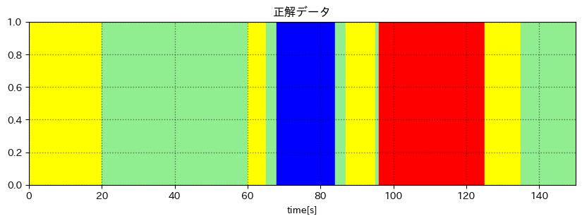

- 赤: 階段
- 青: エレベーター
- 黄: 歩行
- 緑: 待機

### データ3
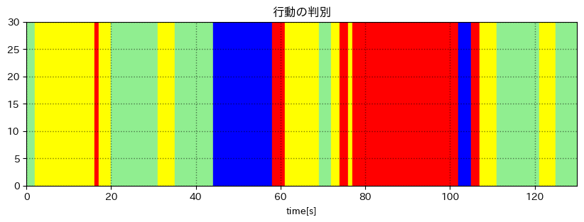
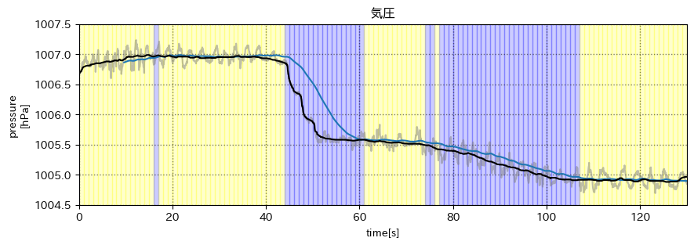

- 青: 歩いている || 上り下りしている
- 黄: 止まっている

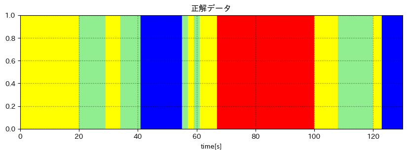

- 赤: 階段
- 青: エレベーター
- 黄: 歩行
- 緑: 待機

# メモ
- [気圧センサーとステップ](https://ipsj.ixsq.nii.ac.jp/ej/?action=repository_uri&item_id=191988&file_id=1&file_no=1)
- [気圧値と回帰直線](http://www.comm.tcu.ac.jp/cisj/15/assets/15_07.pdf)

梶克彦，河口信夫，安定センシング区間検出に基づく3次元歩行軌跡推定手法， 情報処理学会論文誌，Vol.57, No.1, pp.12-24，2016. (特選論文)
https://ipsj.ixsq.nii.ac.jp/ej/index.php?active_action=repository_view_main_item_detail&page_id=13&block_id=8&item_id=147419&item_no=1

- 端末座標系から世界座標系へ
- 加速減速を出す
