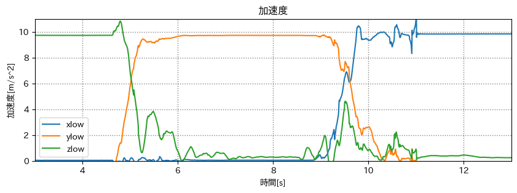
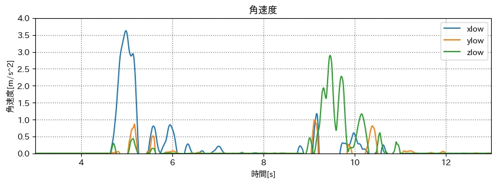
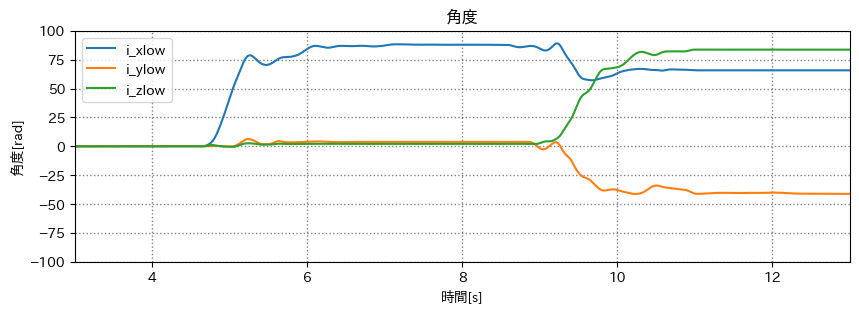
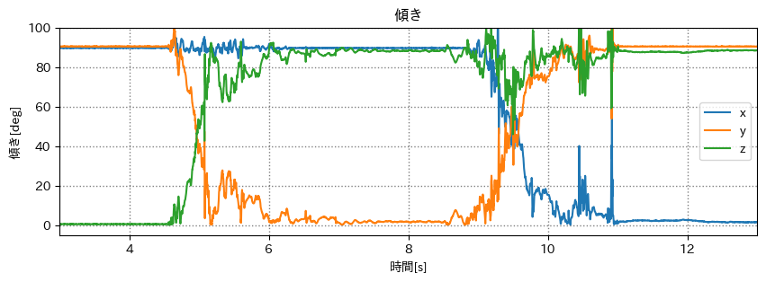
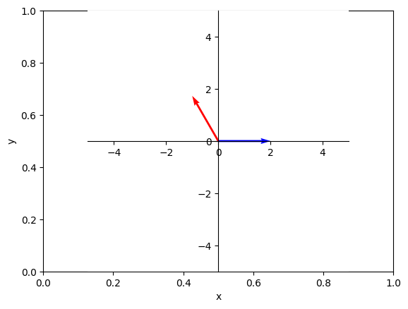

# スケジュール
## 短期的なスケジュール
- [ ] 端末座標系を世界座標系に
  - [x] データをとる
  - [x] 重力に対する各軸の傾きを出す
  - [x] 2次元ベクトルを回転させる
  - [ ] 3次元ベクトルを回転させる
- [ ] 技育CAMP ハッカソン
  - [x] テーマ決め
  - [x] 開発練習
  - [x] 7/9 キックオフ
  - [ ] 7/16 発表


# 端末座標系を世界座標系に
## 方法
1. 各軸の加速度データから3次元ベクトルにする
2. 回転行列を掛けて回転させる
3. 3次元ベクトルから各軸の加速度にする


## データをとる
- pixel5 (android)
- phyphox
  - 加速度センサー
  - 角速度センサー

1. z軸正が上(約4秒)
2. y軸正が上(約4秒)
3. x軸正が上(約4秒)


## グラフ
### 加速度


移動平均フィルター(前後40サンプル)をかけている

### 角速度


移動平均フィルター(前後40サンプル)をかけている

### 角度


移動平均フィルターをかけたものを積分したもの


## 重力に対する各軸の傾きを出す
```python
gravity = math.sqrt(x ** 2 + y ** 2 + z ** 2)

tilt_angle_x = math.degrees(math.acos(x / gravity))
tilt_angle_y = math.degrees(math.acos(y / gravity))
tilt_angle_z = math.degrees(math.acos(z / gravity))
```

### 重力に対するそれぞれの軸の傾き


### ベクトルを回転させる方法
- **回転行列**
- 外積の性質を利用
- クォータニオン

#### 回転行列
回転行列はベクトルに対し始点を基準に回転させる  
=> 始点は端末の中心とし、端末座標系を回転させれば世界座標系になるのでは

## 2次元ベクトルを回転させる
(いきなり3次元は無理があった)

### 計算方法(2次元)
`θrad` 回転する場合
$$
Vec^{\prime} =
\begin{bmatrix}
  \cos \theta & -\sin \theta \\
  \sin \theta & \cos \theta \\
\end{bmatrix}
\begin{bmatrix}
  x \\
  y \\
\end{bmatrix}
$$

### Python
回転行列 R
```python
cos = np.cos(θ)
sin = np.sin(θ)

R = np.array(
  [[cos, -sin], [sin, cos]]
)
```

元のベクトル
```python
vec = [2, 0]
```

回転後のベクトル
```python
vec_dash = np.dot(R, vec)
```

#### グラフ
青を `120deg` 回転させた



## 3次元ベクトルを回転させる
### 計算方法(3次元)
`θrad` 回転する場合

#### x軸周り
$$
Vec_x^{\prime} =
\begin{bmatrix}
  1 & 0 & 0 \\
  0 & \cos \theta & -\sin \theta \\
  0 & \sin \theta & \cos \theta \\
\end{bmatrix}
\begin{bmatrix}
  x \\
  y \\
  z \\
\end{bmatrix}
$$

#### y軸周り
$$
Vec_y^{\prime} =
\begin{bmatrix}
  \cos \theta & 0 & \sin \theta \\
  0 & 1 & 0 \\
  -\sin \theta & 0 & \cos \theta \\
\end{bmatrix}
\begin{bmatrix}
  x \\
  y \\
  z \\
\end{bmatrix}
$$

#### z軸周り
$$
Vec_z^{\prime} =
\begin{bmatrix}
  \cos \theta & -\sin \theta & 0 \\
  \sin \theta & \cos \theta & 0 \\
  0 & 0 & 1 \\
\end{bmatrix}
\begin{bmatrix}
  x \\
  y \\
  z \\
\end{bmatrix}
$$


# メモ
3次元の回転には `ロドリゲスの回転公式` を使えるらしい

- 端末姿勢推定
  - クォータニオン
  - ロール・ピッチ・ヨー

[３軸加速度センサを用いた姿勢推定](https://watako-lab.com/2019/02/15/3axis_acc/)

Kaji, K., Kaneko, M., Ito, N., Naito, K., Chujo, N., Mizuno, T., A PDR Smartphone Application Considering Side/Backward Steps, International Conference on Mobile Computing and Ubiquitous Networking(ICMU2019), 2019.


# 参考
- [ベクトルの回転](https://www.mynote-jp.com/entry/2016/04/30/201249)
