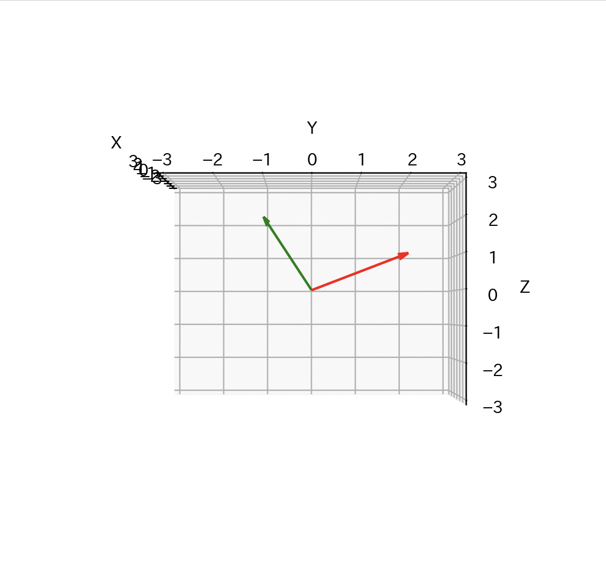
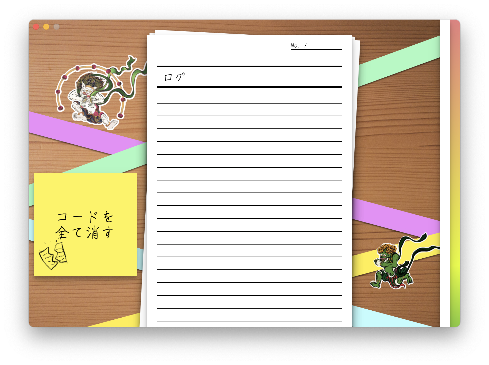
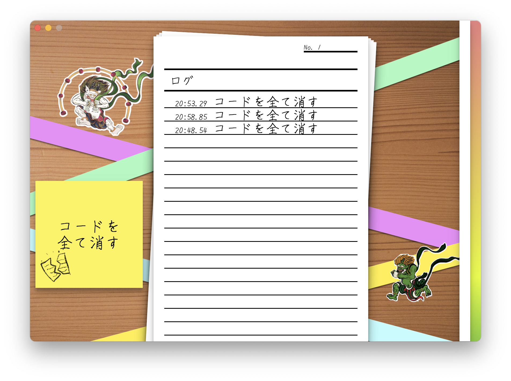
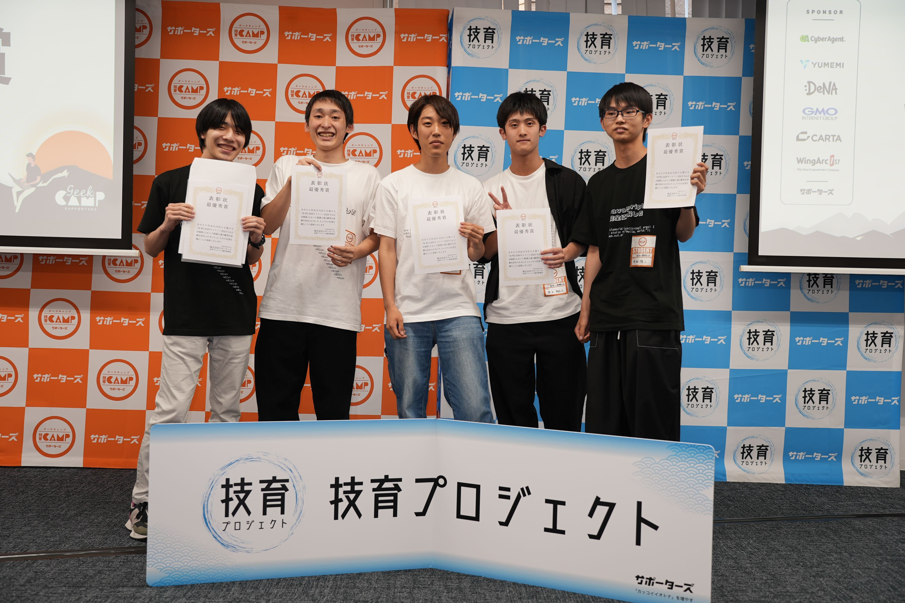

# 技育CAMPに参加した

## 出席率
- 3年セミナー：??%

## スケジュール
### 短期的な予定
- [ ] 端末座標系を世界座標系に
  - [x] データをとる
  - [x] 重力に対する各軸の傾きを出す
  - [x] 2次元ベクトルを回転させる
  - [x] 3次元ベクトルを回転させる
  - [ ] 端末座標系を世界座標系に変換する
- [x] 技育CAMP ハッカソン
  - [x] テーマ決め
  - [x] 開発練習
  - [x] 7/9 キックオフ
  - [x] 7/16 発表

### 長期的な予定
- 9/2 OpenHackU 発表
- 10/7,8 工科展

# 進捗報告
## 3次元ベクトルを回転させる
### 先週までの問題点
[2, 0, 0] をx軸で90度回転 回転 → [2, 0, 0]
回転できてない？

計算式を(なんとなく)理解してみる
$$
Vec_x^{\prime} =
\begin{bmatrix}
  1 & 0 & 0 \\\\
  0 & \cos \theta & -\sin \theta \\\\
  0 & \sin \theta & \cos \theta \\\\
\end{bmatrix}
\begin{bmatrix}
  x \\\\
  y \\\\
  z \\\\
\end{bmatrix}
$$

```
x = (vec[0] * 1) + (vec[0] * 0) + (vec[0] * 0)
y = (vec[1] * 0) + (vec[0] * cosθ) + (vec[0] * sinθ)
z = (vec[2] * 0) + (vec[0] * -sinθ) + (vec[0] * cosθ)
```
xはそのまま y, z は0だから変化しない
=> x軸周りに90度ならばxは変化するわけがない(y, zを0以外に) 

## x軸正の方からみたベクトル
[2, 2, 1] をx軸周りに90度


赤が元ベクトル
緑が回転後ベクトル

90度回転している
=> 正しく回転させれている


# 余談
## 技育CAMPに参加した
## 制作物
### かみあぷり
紙を破ることでPCを操作できるアプリ

### 画面


### 操作方法
付箋をクリックすると内容が変わる


### ログ
紙を破ったと判断されるとログが追加される


## 技術スタック
- バックエンド
    - Tauri
    - AppleScript
- フロントエンド
   - HTML/CSS
    - Vanilla JS
    - フレームワーク
        - TensorFlow.js

1. TensorFlow.js で紙を破ったかを判別する.  
2. JS からTauri の shell を呼び出す
3. shell で AppleScript(osascript) を実行する
4. osascript の keystroke などで実行

## 結果
**最優秀賞** をととれた！


# 振り返り
## 良かったこと
- オフラインということで、実際にやってうけるようなネタにした
- はじめのネタのような動画で惹きつけれた
- 色んな先輩や友達に聞いたことで、簡潔で分かりやすいスライドにできた
- 実際に行ったデモで面白さを伝えれた
- slackでダウンロードリンクを送ることで発表後に見てもらえた
- チーム名やお揃いのネタTシャツで覚えてもらいやすかった

## 悪かったこと
- 最後に "あるがとうございました" と言わなく、締めが微妙だった
- ネタバレを防ぐためとは言え、メンターを頼らなさすぎた
- 計画的に進めすぎて当日にやることがなかった
- 宿を取らなかったこと