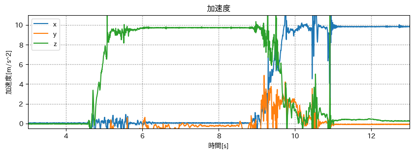

# 端末座標系を世界座標系に

## 出席率
- 3年セミナー：??%

## スケジュール
### 短期的な予定
- [ ] 端末座標系を世界座標系に
  - [x] データをとる
  - [x] 重力に対する各軸の傾きを出す
  - [x] 2次元ベクトルを回転させる
  - [x] 3次元ベクトルを回転させる
  - [ ] 端末座標系を世界座標系に変換する

### 長期的な予定
- 8/5 技育キャンプ ハッカソン
- 8/12 技育展
- 8/26 OpenHackU
- 9/2 技育キャンプ アドバンス
- 10/7,8 工科展

# 進捗報告
## 3次元ベクトルを回転させる
### 元の加速度

### 端末の傾き

元の加速度 を 端末の傾き だけ回転させる

### 回転後のベクトル

理想は y は常に9.8, x,z は常に0 になるはず  
=> roll, pitch, yaw の回転のさせ方の問題？

### roll だけ掛けたグラフ

y(橙) が理想に近づいた

### pitch だけ掛けたグラフ

### yaw だけ掛けたグラフ

上下が合えばいいから roll, pitch, yaw 全て使う必要はないかも?

## 考え直す
計算した `roll`, `pitch`, `yaw` が入れ替わってしまっている可能性がある

#### 端末の座標系

#### 端末の傾き

### 0s - 4s
端末の状態は z軸正が上向き  
=> `pitch` 以外が回転している

傾きが `0deg` である `緑` は `pitch` か `yaw`  
(`yaw` として扱っていた)

### 6s - 8s
端末の状態は y軸正が上向き  
=> 傾きが `0deg` である `橙` が `roll` か `pitch`  
(`pitch` として扱っていた)

### 11s - 13s
端末の状態は x軸正が上向き  
=> 傾きが `0deg` である `青` が `roll` か `yaw`  
(`roll` として扱っていた)

### 変更後のグラフ 1
- roll: 橙
- yaw: 青
- pitch: 緑

とした場合のグラフ

違う.  

### 変更後のグラフ 2
いろいろ試してみた
- roll: 青
- yaw: 橙
- pitch: 緑

とした場合のグラフ

緑(z軸) が 常にほぼ `0(m/s^2)` になった.  
y軸が `9.8(m/s^2)` になって欲しい

### 変更後のグラフ 3
いろいろ試してみた
- roll: 青
- yaw: 緑
- pitch: 橙

とした場合のグラフ

青(x軸) が 常にほぼ `0(m/s^2)` になった.  

### 変更後のグラフ 4
いろいろ試してみた
- roll: 青
- yaw: 橙
- pitch: 緑

とした場合のグラフ

9秒までは結構理想的な形になっている.  
ただし, `9.8(m/s^2)` は x軸になっている.  
(軸自体も間違っている可能性もある)

全パターン試したけど理想的な形のものにはならなかった.  
x, z が 0 にはなるが y が 9.8 にならない.  
=> 回転のさせ方が間違っている可能性がある

## 回転させる順番
### 回転行列
#### x軸周り
$$
R_x =
\begin{bmatrix}
  1 & 0 & 0 \\
  0 & \cos \theta & -\sin \theta \\
  0 & \sin \theta & \cos \theta \\
\end{bmatrix}
$$

#### y軸周り
$$
R_y =
\begin{bmatrix}
  \cos \theta & 0 & \sin \theta \\
  0 & 1 & 0 \\
  -\sin \theta & 0 & \cos \theta \\
\end{bmatrix}
$$

#### z軸周り
$$
R_z =
\begin{bmatrix}
  \cos \theta & -\sin \theta & 0 \\
  \sin \theta & \cos \theta & 0 \\
  0 & 0 & 1 \\
\end{bmatrix}
$$

としたとき,  
回転行列をかける順番によって結果が変わる

$$
\begin{bmatrix}
  x \\
  y \\
  z \\
\end{bmatrix}
{\times}R_x
{\times}R_y
{\times}R_z

{\neq}

\begin{bmatrix}
  x \\
  y \\
  z \\
\end{bmatrix}
{\times}R_y
{\times}R_x
{\times}R_z
$$

## 例
$$
\begin{bmatrix}
  2.82 \\
  4.25 \\
  3.45 \\
\end{bmatrix} =
\begin{bmatrix}
  2 \\
  3 \\
  5 \\
\end{bmatrix}
{\times}R_x
{\times}R_y
{\times}R_z
$$

$$
\begin{bmatrix}
  0.83\\
  5.24\\
  3.12\\
\end{bmatrix} =
\begin{bmatrix}
  2 \\
  3 \\
  5 \\
\end{bmatrix}
{\times}R_y
{\times}R_z
{\times}R_x
$$

## 余談

バイトを辞めれませんでした

夏休み忙しそうだし、辞めようと思った.  
が,  店長がいい人すぎてお願いを断れなかった.  
8-10月まで休みを貰うことに  

## メモ
そもそも 端末座標系では `y軸` が垂直方向だが、
世界座標系では `z軸` を垂直方向としていてズレている

### TODO
1. 割り出した `roll` `yaw` `pitch` が正しいか検証
2. イラスト や Unity などで端末の状態を可視化
3. 回転行列を掛ける順番を検証

### 理想の端末の傾き

(最初の端末の状態を世界座標系と一致させること)
