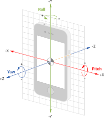
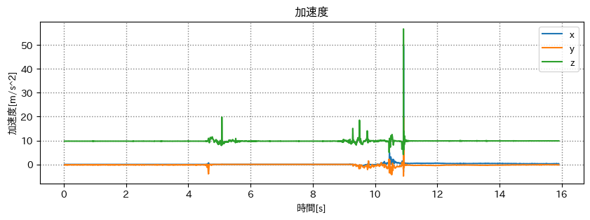
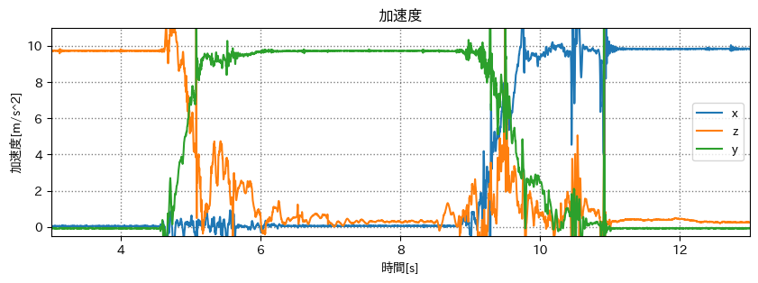
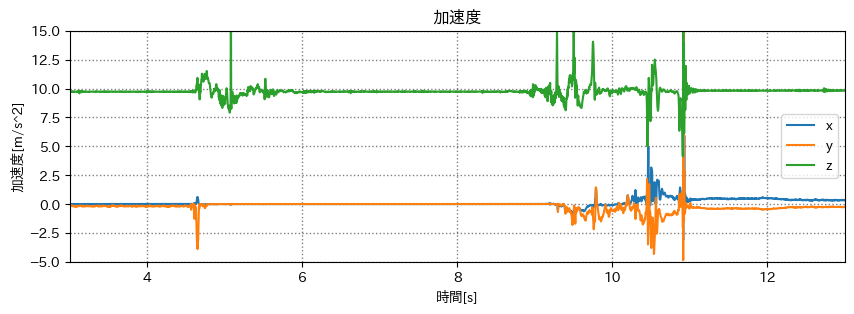
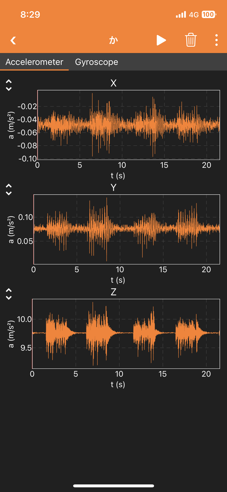
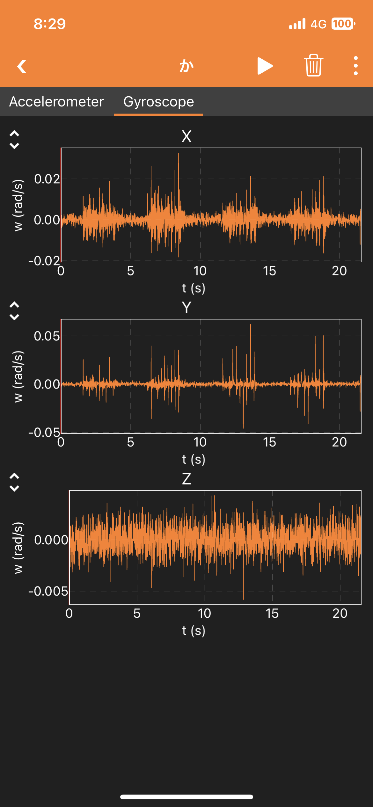

# 端末座標系を世界座標系に

## 出席率
- 3年セミナー：??%

## スケジュール
### 短期的な予定
- [x] 端末座標系を世界座標系に
  - [x] データをとる
  - [x] 重力に対する各軸の傾きを出す
  - [x] 2次元ベクトルを回転させる
  - [x] 3次元ベクトルを回転させる
  - [x] 端末座標系を世界座標系に変換する

### 長期的な予定
- 8/5 技育CAMP ハッカソン
- 8/12 技育展
- 8/26 OpenHackU
- 9/2 技育CAMP アドバンス
- 10/7,8 工科展

# 進捗報告


## 世界座標の基準
スマホの画面(z軸正)が垂直上向の状態を世界座標の基準とする

## 端末の傾きの出し方の確認
#### 端末の傾きの計算方法
```python
roll  = math.acos(x / gravity)
pitch = math.acos(y / gravity)
yaw   = math.acos(z / gravity)
```

### z軸正が上向きの場合
- x軸: 0.0(m/s^2)
- y軸: 0.0(m/s^2)
- z軸: 9.8(m/s^2)

```text
x軸: 90.0度 (0度)
y軸: 90.0度 (0度)
z軸: 0.0度 (0度)
```
`()` 内は理想

### x軸正が上向きの場合
- x軸: 9.8(m/s^2)
- y軸: 0.0(m/s^2)
- z軸: 0.0(m/s^2)

```text
x軸: 0.0度 (0度)
y軸: 90.0度 (0度)
z軸: 90.0度 (0度)
```

### y軸正が上向きの場合
- x軸: 0.0(m/s^2)
- y軸: 9.8(m/s^2)
- z軸: 0.0(m/s^2)

```text
x軸: 90.0度 (0度)
y軸: 0.0度 (0度)
z軸: 90.0度 (0度)
```

## 計算方法の変更
この計算方法では**重力と各軸の角度**を出している  

```text
x軸(roll) : 90.0度
y軸(pitch): 90.0度
z軸(yaw)  : 0.0度
```
この状態を基準とすると
### x軸正が上向きの場合
```text
x軸(roll) : -90.0度
y軸(pitch): 0.0度
z軸(yaw)  : -90.0度
```

### y軸正が上向きの場合
```text
x軸(roll) : 90.0度
y軸(pitch): 0.0度
z軸(yaw)  : 90.0度
```

### 回転後のグラフ


### 比較
#### 元データ

#### 回転後


動かしているときは誤差が生まれているが、
静止状態では理想的な値になっている

加速度では下方向しかとれないため、
垂直方向(今回はz軸)を軸とした回転量はわからないのでは?


## 余談
スマホを机に置いた状態で、周りをコンコン叩いた様子
右→下→左→上

なにか遊べそう
(オンラインとんとん相撲的な)





# メモ
カルマンフィルター

> 藤田迪，梶克彦，河口信夫， Gaussian Mixture Modelを用いた無線LAN位置推定手法， 情報処理学会論文誌，Vol.52, No.3, pp.1069-1081, 2011.
> GMM 確率密度関数

[Gaussian Mixture Modelを用いた無線LAN位置推定手法](https://cir.nii.ac.jp/crid/1050001337900524672)