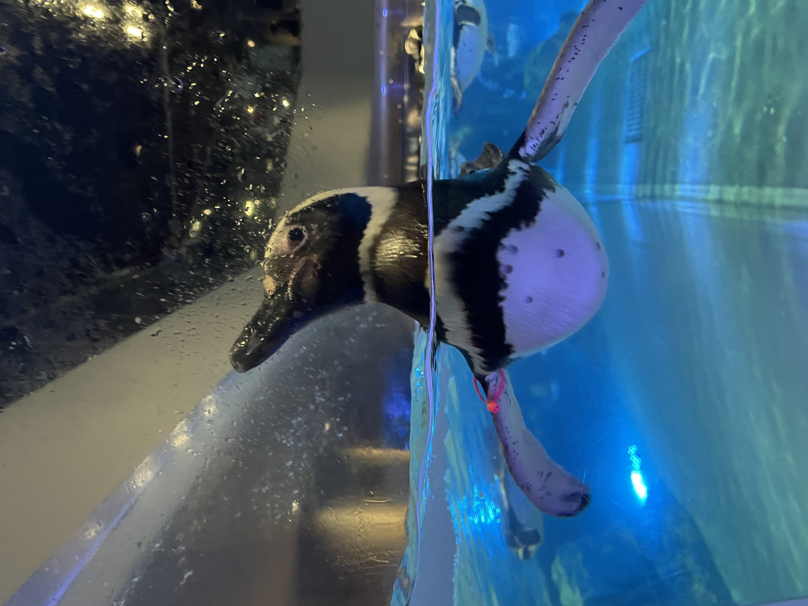

# 磁気センサで方位角を測る

## 出席率
- 3年セミナー：??%

## スケジュール
### 短期的な予定
- [x] 方位角を測る
  - [x] x と y から求める
  - [ ] 3次元的に求める
- [ ] 技育CAMP vol.7(技育展)
  - [x] 案出し
  - [x] 役割分担
  - [ ] アプリイメージの作成
  - [ ] サイトの作成
  - [ ] スライドの作成
  - [ ] 発表

### 長期的な予定
- 8/5 技育CAMP ハッカソン
- 8/12 技育展
- 8/26 OpenHackU
- 9/2 技育CAMP アドバンス
- 10/7,8 工科展


# 進捗
## 方位角を測る
### 手段
磁気センサの値から `arccos(x/y)` を用いて出す

### データを取る
画面(z軸正)を上向ける  
y軸正が北を向いた状態から左回転で360度回す

#### 磁気センサーデータ


### 求め方
`x/y` から `arccos` を用いて方位角を出す

```python
df_mag["angle"] = df_mag.apply(
    lambda row: np.degrees(math.atan2(row["x"], row["y"])),
    axis=1
)
```

#### 方位角のグラフ


`-180度 ~ 180度` のためグラフが急激に変化しているが理想通り  

`x/y` で計算しているためスマホを立てると狂う  
=> 重力加速度を元に補正する


### データを取る
1. y軸正が北
2. z軸正が北
3. x軸正が北

[データをとっている様子](https://www.youtube.com/shorts/KbA5ZnaWGz0)

### 方法
1. 重力加速度を元に傾きを出す
2. 端末の傾きを磁気センサに適用する
3. 世界座標を基準とした磁気センサから方位角を出す

#### 磁気センサデータ


#### 回転後の磁気センサデータ


理想は ~5s は 0度、 5s~ は -90度 となるはず  
=> 開始時から-120度となってしまい、磁気センサの値がおかしい

他の端末でもおかしいため、屋外で計り直す必要がある


## 技育CAMP
### テーマ
**記事に視覚的な繋がりある蔵(仮)**

### アプリ説明
#### 誰の
プログラミングを学んでいる人

#### どんな課題を
自分の知らない知識は調べられない

### どのように解決するか
木構造で知っている単語からリンクして見つける

#### イメージ

知っている言葉から辿ることで知らない言葉を知ることができる  

## 使用技術
### フロントエンド
- Next.js (TypeScript)

### バックエンド
- Nest.js (TypeScript)

### 実装する機能
#### 最優先
- 記事の表示
- ツリー構造の表示
    - 閲覧ノードの移動

#### 優先
- ノード・記事の作成
    - 親子ノードの設定
- ノードの検索

#### できれば
- ノード・記事の削除
- ログイン
- 記事の編集
- 親・子ノードの移動
- 画像のアップロード


## 余談
### Mrs.Green Apple のライブに行ってきた!!

めっちゃ後ろだったけど、会場全体が見れて楽しかった

### 品川台場 に行ってきた!!

続百名城の1つ. 初めての台場をみれてよかった

### マゼランペンギン を見てきた!!

初めて見るマゼランペンギン. かわいい


# メモ
- 向いている方向を出すのはどのセンサでも一長一短  
  - ジャイロは時間が経つとずれる
  - 磁気は建物の影響を受ける


## チーム
