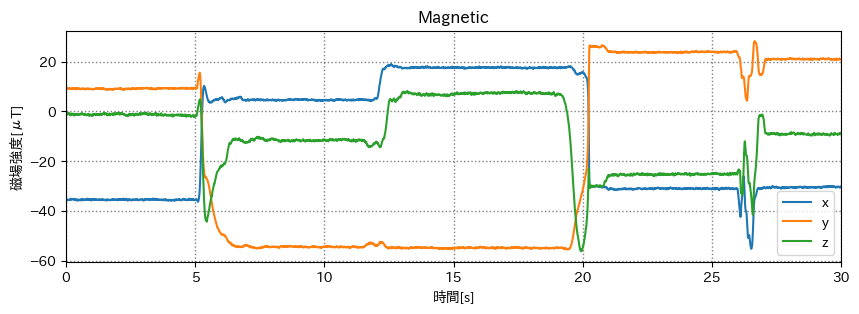
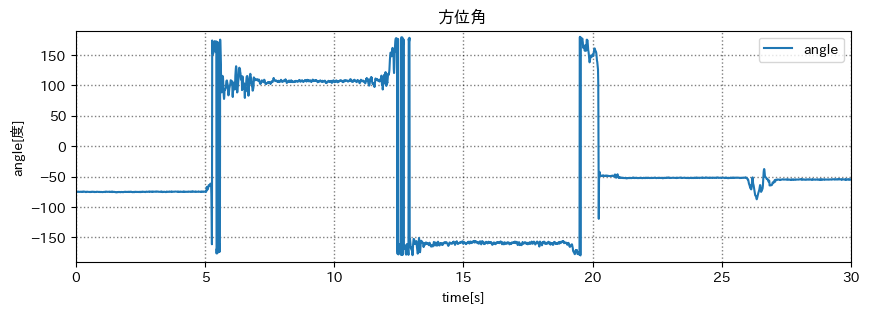
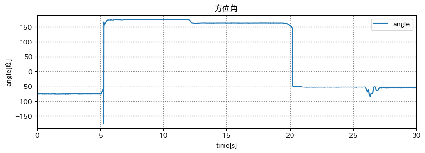
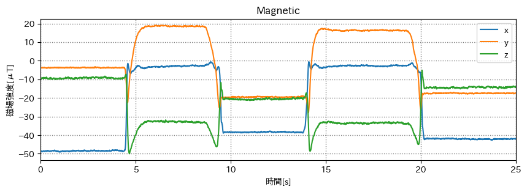
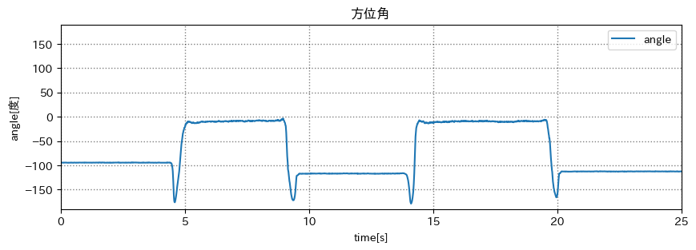
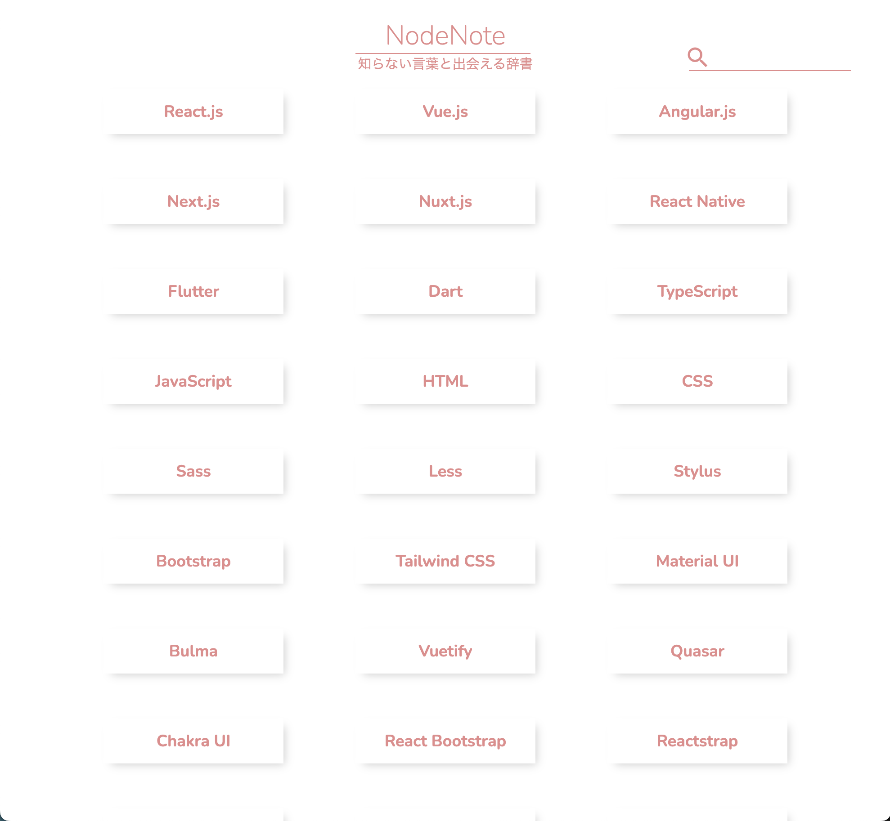
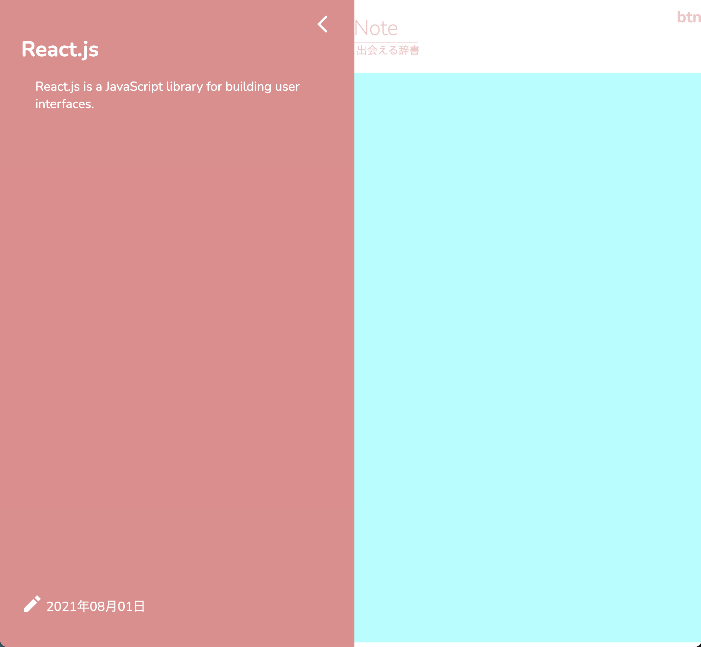
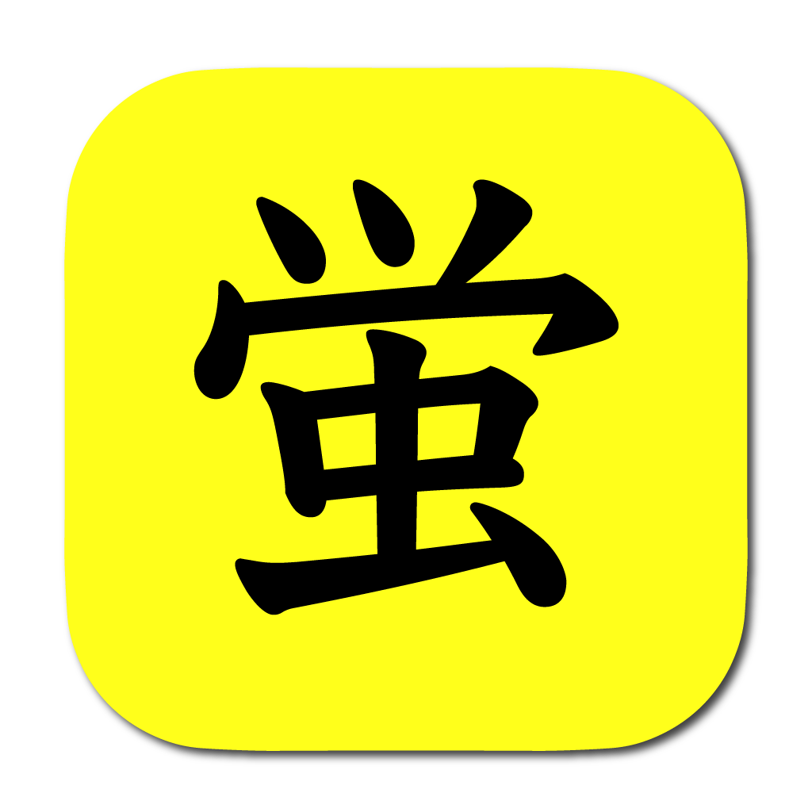

# 磁気センサで方位角を測る

## 出席率
- 3年セミナー：??%

## スケジュール
### 短期的な予定
- [x] 方位角を測る
  - [x] x と y から求める
  - [ ] 3次元的に求める
- [ ] 技育CAMP vol.7(技育展)
  - [x] 案出し
  - [x] 役割分担
  - [x] アプリイメージの作成
  - [x] サイトの作成
  - [ ] スライドの作成
  - [ ] 技育CAMP vol.7 発表(8/5)
  - [ ] 技育展中部ブロック 発表(8/12)
- [ ] HackU Nagoya
  - [x] 案出し
  - [x] 役割分担
  - [ ] アプリイメージの作成
  - [ ] サイトの作成
  - [ ] スライドの作成
  - [ ] 発表 (8/27)

### 長期的な予定
- 8/5 技育CAMP ハッカソン
- 8/12 技育展
- 8/26 OpenHackU
- 9/2 技育CAMP アドバンス
- 10/7,8 工科展

# 進捗
## 進捗報告
## 方位角を測る
1. z軸上向き, y軸が北
1. y軸上向き, z軸が北
1. y軸上向き, x軸が北
1. z軸上向き, x軸が北

### データの取得
<iframe width="442" height="786" src="https://www.youtube.com/embed/bL6hZjugGCo" title="磁気センサーから方位角を出す 2" frameborder="0" allow="accelerometer; autoplay; clipboard-write; encrypted-media; gyroscope; picture-in-picture; web-share" allowfullscreen></iframe>

### 理想
1. z軸上向き, y軸が北
    - 0度
1. y軸上向き, z軸が北
    - 0度
1. y軸上向き, x軸が北
    - 90度
1. z軸上向き, x軸が北
    - 90度

#### 元データ

#### 回転後

(0~5s では0度のはず)

A: 0-5s 
B: 6-12s
C: 14-19s
D: 21-25s
とすると、

A-B間:  +175度
B-C間: +110度(-250度)
C-D間: +100度

となっている

#### xyから出した方位角

はじめの向きが北(0度)ではない.
標準のコンパスと差が出ているため、磁場強度の値を元に北(仮)を決める必要がありそう

近くの金属からの影響もあるかも

端末の向きは変えずに机に置く、離すを繰り返した時のデータ
### 磁場強度

### 方位角

## 技育CAMP vol.7(技育展)
### サイトの作成(途中)
#### トップページ

#### メインページ

(水色部分には単語のツリーを表示する)

## HackU Nagoya
[技術系TikTok 概要](https://kjlb.esa.io/posts/4404)

## 余談
### 没案を消費 hotaru.app
**蛍の光を流して帰宅促進**

メニューバー常駐型アプリ
簡単に蛍の光を流すことができます

(指定時間に流せるようにしたい)
  

## メモ
加速度と角速度から端末座標を出す
- 加速度に変化がない時は、重力加速度の方向を使って端末座標を出す
- 変化がある時は、ジャイロセンサーの値を使って端末座標を変化させる

カルマンフィルタ
