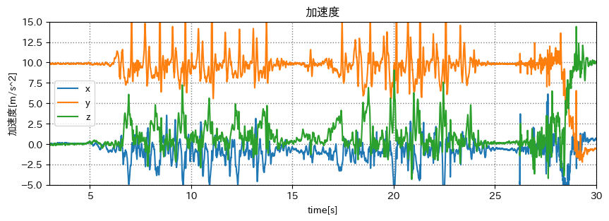
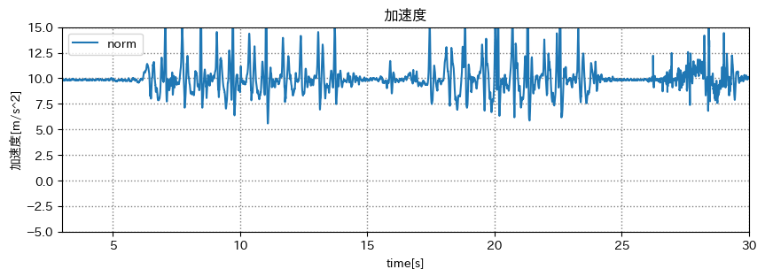
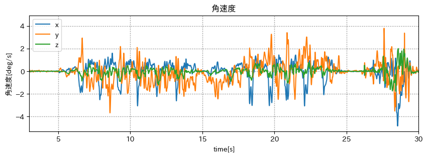
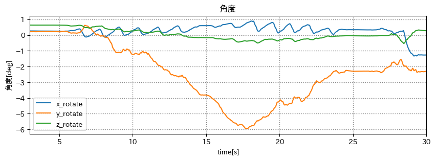
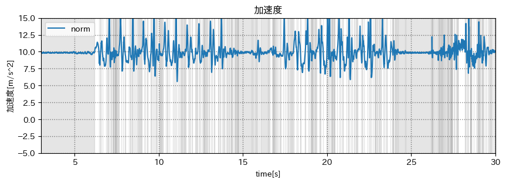
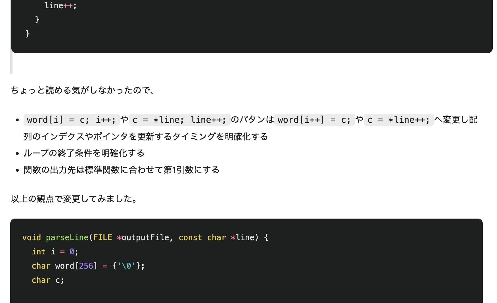

# 端末状態推定

## 出席率
- 3年セミナー：??%

## スケジュール
### 短期的な予定
- [x] 端末状態推定
- [ ] 技育CAMP vol.7(技育展)
  - [x] 案出し
  - [x] 役割分担
  - [x] アプリイメージの作成
  - [x] サイトの作成
  - [ ] スライドの作成
  - [ ] 技育CAMP vol.7 発表(8/5)
  - [ ] 技育展中部ブロック 発表(8/12)
- [ ] HackU Nagoya
  - [x] 案出し
  - [x] 役割分担
  - [ ] アプリイメージの作成
  - [ ] サイトの作成
  - [ ] スライドの作成
  - [ ] 発表 (8/27)

### 長期的な予定
- 9/2 技育CAMP アドバンス
- 10/7,8 工科展

## 進捗報告
## 端末状態推定
加速度と角速度, カルマンフィルターを使って端末の状態を推定する  

### 値をとる
`歩く - 止まる - 曲がる - 歩く` を繰り返す

<iframe width="439" height="780" src="https://www.youtube.com/embed/wrP0ZNd1iRs" title="端末状態推定 1" frameborder="0" allow="accelerometer; autoplay; clipboard-write; encrypted-media; gyroscope; picture-in-picture; web-share" allowfullscreen></iframe>

#### 加速度のグラフ

#### 加速度のノルムのグラフ

#### 角速度のグラフ

#### 角度のグラフ

### 考え方
- 加速度に変化がない時は、重力加速度の方向を使って端末状態を出す
- 変化がある時は、ジャイロセンサーの値を使って端末状態を変化させる

norm が 9.5(m/s^2) 以上 10.1(m/s^2) 以下の時は、動いていないと判断する

灰色 が動いていない判定

歩いている途中でも 9.8(m/s^2) 前後になるが、重力加速度しか掛かっていないから、加速度センサーから推定しても良い?

(カルマンフィルターの使い方がわからない)

## 余談
### Qiitaで正論パンチ喰らってます

知らない人からの無機質な指摘は怖い...  
が、とても為になる

### 読書の夏

テスト週間は読書が捗ります.  
そろそろ新しい言語に触れ合いたい!!(Rust or Kotlin?)

(藤崎彩織さんは SEKAI NO OWARI のメンバーです.)
