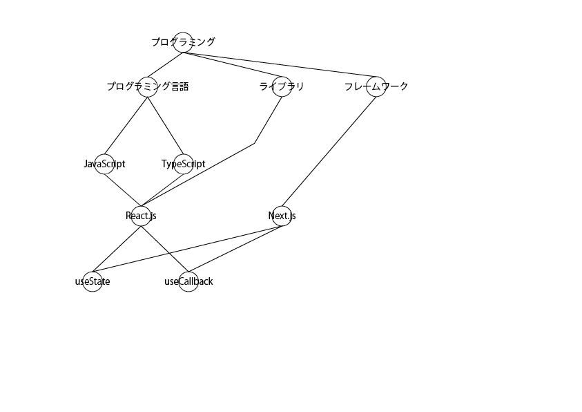
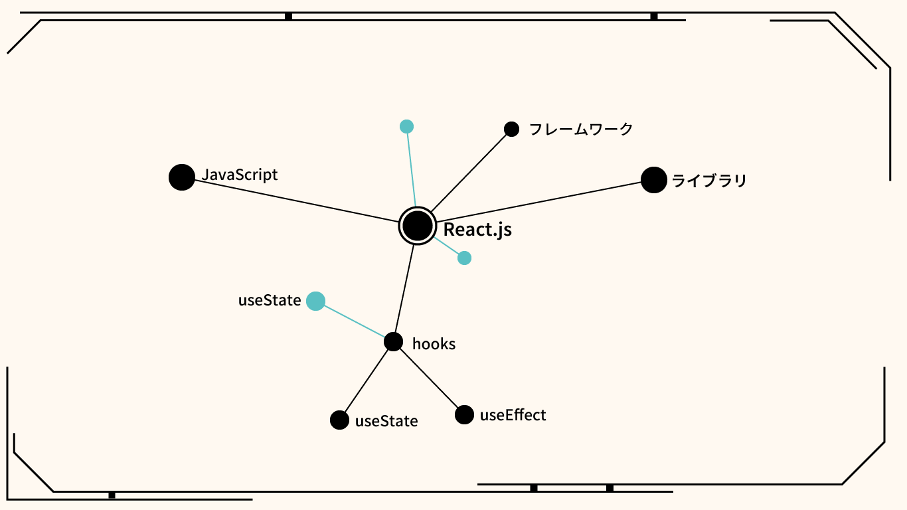
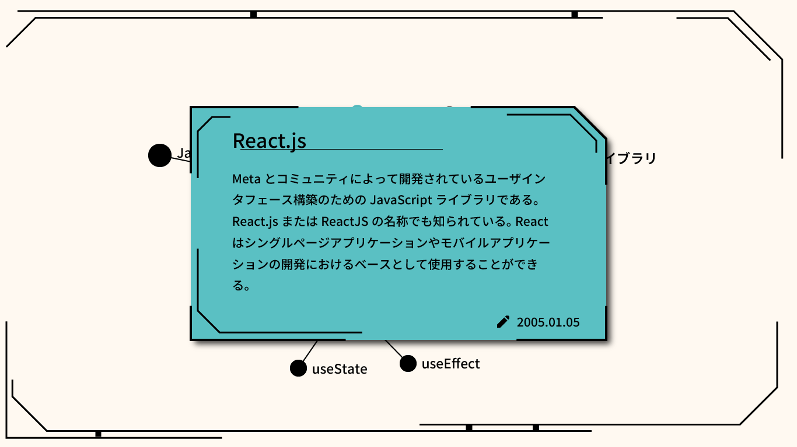
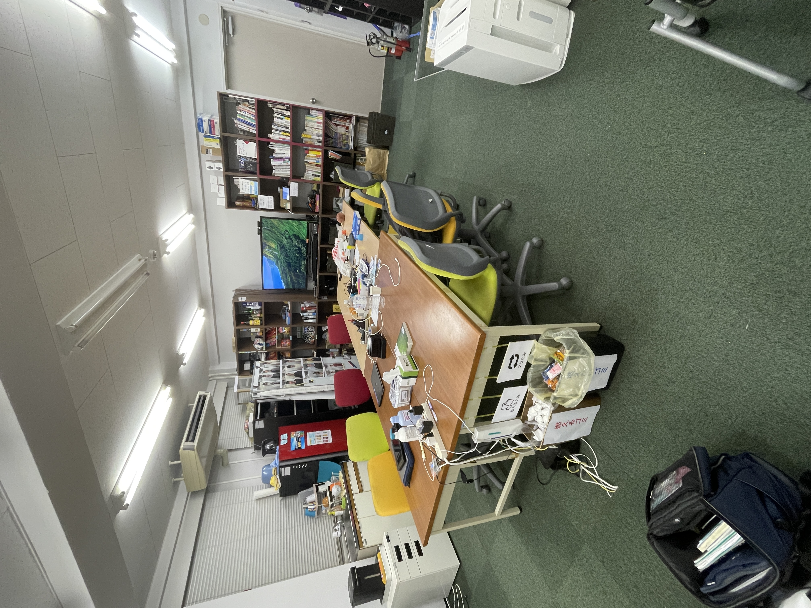

## スケジュール
### 短期的な予定
- [ ] 端末状態推定
- [ ] 技育CAMP vol.7(技育展)
  - [x] 案出し
  - [x] 役割分担
  - [x] アプリイメージの作成
  - [x] サイトの作成
  - [ ] スライドの作成
  - [ ] 技育CAMP vol.7 発表(8/5)
  - [ ] 技育展中部ブロック 発表(8/12)
- [ ] HackU Nagoya
  - [ ] 案出し
  - [x] 役割分担
  - [ ] アプリイメージの作成
  - [ ] サイトの作成
  - [ ] スライドの作成
  - [ ] 発表 (8/27)

### 長期的な予定
- 9/2 技育CAMP アドバンス
- 10/7,8 工科展

## 進捗報告
# 技育CAMP vol.7(技育展)
## 表示を変更
木構造はごちゃごちゃして面白くない

ネットワーク構造に変更
ついでにUIも変更

## 変更後のサイト
<video controls width="480" alt="画面収録 2023-08-01 8.02.40.mov (1.5 MB)" src="https://esa-storage-tokyo.s3-ap-northeast-1.amazonaws.com/uploads/production/attachments/13979/2023/08/01/148142/2ef8dbfe-46e3-48fc-b88a-02a2c6580c29.mov"></video>

~~無駄に~~ HTML と CSS だけで描いた

## トップ画面
<iframe width="560" height="315" src="https://www.youtube.com/embed/-V5rycjsQlw" title="YouTube video player" frameborder="0" allow="accelerometer; autoplay; clipboard-write; encrypted-media; gyroscope; picture-in-picture; web-share" allowfullscreen></iframe>

## ドロワー
<iframe width="560" height="315" src="https://www.youtube.com/embed/lNgOZlryvS4" title="YouTube video player" frameborder="0" allow="accelerometer; autoplay; clipboard-write; encrypted-media; gyroscope; picture-in-picture; web-share" allowfullscreen></iframe>

# Hack U
## 案の変更(？)
**技術系TikTok** → **LT会簡単にする蔵(仮)**

### 概要
- LT会をオンラインでも開催できるようにするアプリ
- アーカイブも残せる

### 説明
#### 発表者
1. スライド(pptx, pdf) をあらかじめアップロードしてもらう
1. 発表はサイト上で行ってもらう (Google スライドのイメージ)

#### 閲覧者
- 発表中の場合、リアルタイムでスライドが遷移し、音が聞こえる
- アーカイブの場合、発表中と同様に見れる

### メリット
- LT会特有の「発表資料、内容が一度きりになる」といった課題を解決できる
- ハッカソン等でも簡単にアーカイブを残し、後から見てもらうことができる
- 当日の発表で実演できる

### 技術的挑戦ポイント
#### 音声のリアルタイム共有
webRTC を使う
- P2P で通信できるwebAPI

#### スライドの音声のタイミング
スライドの遷移タイミングと音声のタイミングを合わせる

### 懸念点
- pptxに埋め込まれた動画がライブラリでは再生されない
    - pptxを解凍し動画を取り出した上で、xmlを解析し再生タイミングを取得すれば可能
- 発表者が動画を停止した場合、そのタイミングが分からない
- フォントが変わってしまい、レイアウトが崩れる

## 余談
### 高級ホテル に泊まりました

もう暫くはいい...
