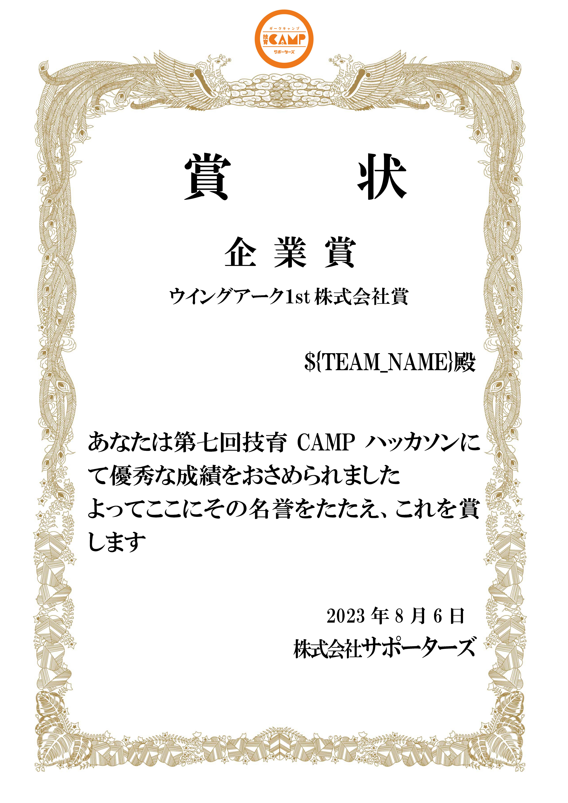
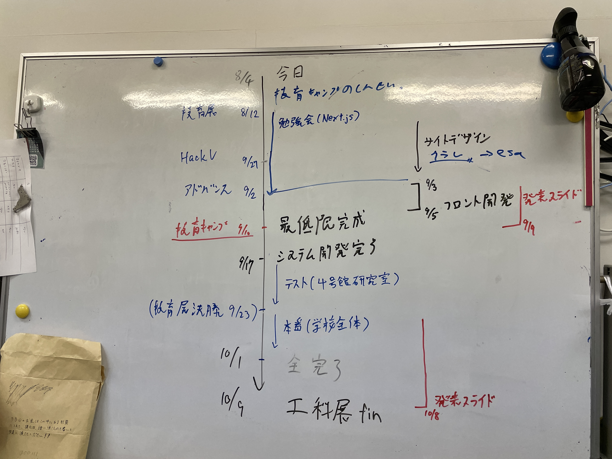
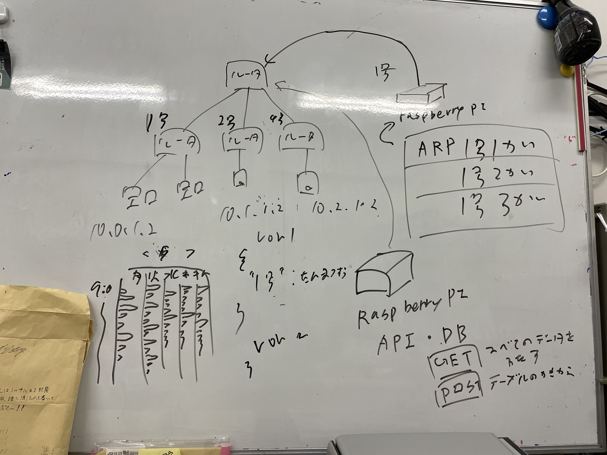
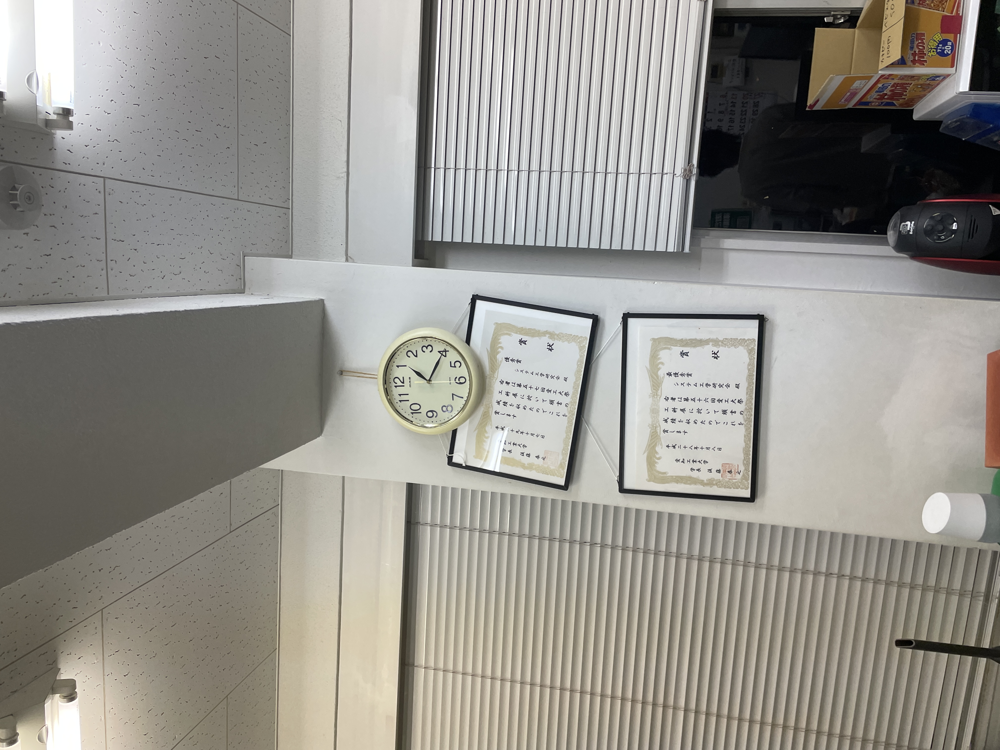

# 技育CAMP マンスリーハッカソン vol.7

## 出席率
- 3年セミナー：??%

## スケジュール
### 短期的な予定
- [ ] 端末状態推定
- [x] 技育CAMP vol.7(技育展)
  - [x] 案出し
  - [x] 役割分担
  - [x] アプリイメージの作成
  - [x] サイトの作成
  - [x] スライドの作成
  - [x] 技育CAMP vol.7 発表(8/5)
  - [ ] 追加開発
  - [ ] 技育展中部ブロック 発表(8/12)
  - [ ] 追加開発
  - [ ] 技育CAMPアドバンス 発表(9/2)
- [ ] HackU Nagoya
  - [x] 案出し
  - [x] 役割分担
  - [x] キックオフ
  - [ ] アプリイメージの作成
  - [ ] サイトの作成
  - [ ] スライドの作成
  - [ ] 発表 (8/27)

### 長期的な予定
- 9/2 技育CAMP アドバンス (梶研)
- 9/2 技育CAMP アドバンス (シス研)
- 9/9 技育CAMP vol.9 (シス研)
- 10/7,8 工科展

## 進捗報告
## 技育CAMP / 技育展
### 制作物
wisdom Tree - 知ってる単語から知らない単語を視覚的に見つけられるサービスです.

<iframe width="560" height="315" src="https://www.youtube.com/embed/8OoMQy0keGE" title="YouTube video player" frameborder="0" allow="accelerometer; autoplay; clipboard-write; encrypted-media; gyroscope; picture-in-picture; web-share" allowfullscreen></iframe>

### 検索機能の追加
- 完全一致したらそのノードが表示される
- 完全一致しなかった場合、候補が表示される

### APIからのデータ取得
フロントの仮データを扱っていたものを、APIから取得するように変更した.

### レイアウトの微修正
- フレーム外を非表示にした

### sqlite から MySQL へ移行
処理を分散して行い、Gitで管理するために sqlite を使用した.  
デプロイ時はMySQLを使用するため、sqliteからMySQLへの移行を行った.

データの数が ノード が 1万件, エッジ が 50万件 あるため、データの移行には時間がかかる.
(計2時間近く)

### 結果
企業賞!  
2連続賞を獲得することができたから、まぁ満足!!  
技育展中部ブロックにも出場するので、そこでの発表に向けて改善を行う.

※ ${TEAM_NAME} の読み方は "あんでふぁいんど" です.

### 技育展に向けて
- ユーザー認証(編集時)
- 編集機能の追加
- 検索をより楽に
- ダイアログの時間表示を修正
- sqlite からMySqlへの移す
- APIの修正に合わせる

## 余談
### 工科展に向けて

牧野先輩と計画を進めた.

### 技育CAMP vol9
m先輩の圧により、工科展の前に 技育CAMP vol9 に出すことになった.
- tada
- 牧野先輩

### ポテトパーティー

