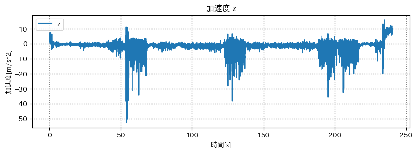

# 技育展予選 & HackU

## 出席率
- 3年セミナー：??%

## スケジュール
### 短期的な予定
- [x] 技育CAMP vol.7(技育展)
  - [x] 案出し
  - [x] 役割分担
  - [x] アプリイメージの作成
  - [x] サイトの作成
  - [x] スライドの作成
  - [x] 技育CAMP vol.7 発表(8/5)
  - [x] 追加開発
  - [x] 技育展中部ブロック 発表(8/12)
  - [ ] 追加開発
  - [ ] 技育CAMPアドバンス 発表(9/2)
- [ ] HackU Nagoya
  - [x] 案出し
  - [x] 役割分担
  - [x] キックオフ
  - [x] アプリイメージの作成
  - [x] サイトの作成
  - [ ] スライドの作成
  - [ ] 発表 (8/27)

### 長期的な予定
- 9月~ 端末状態推定
- 9/2 技育CAMP アドバンス
- 9/23 技育展 決勝

## 進捗報告
## 技育展
### 制作物
**Wisdom Tree**
単語の繋がりから知らない単語を知れるサービス

<iframe width="560" height="315" src="https://www.youtube.com/embed/6Ipzoq80AZY?si=eBYGUndlLVIpseNf" title="YouTube video player" frameborder="0" allow="accelerometer; autoplay; clipboard-write; encrypted-media; gyroscope; picture-in-picture; web-share" allowfullscreen></iframe>

### 結果

技育展決勝進出!

### TODO
- 表示の改善
- ノードの関係を改善
- 発表方法(デモ)の変更

## HackU 2023 Nagoya
### 制作物
手軽にアウトプットできるアプリ

テキストからスライドと音声を生成してくれる
ながらのインプットができる

### アプリイメージ

### 実装
<iframe width="560" height="315" src="https://www.youtube.com/embed/JKM-eRHnC4s?si=0WddEMaYwnSwyi8a" title="YouTube video player" frameborder="0" allow="accelerometer; autoplay; clipboard-write; encrypted-media; gyroscope; picture-in-picture; web-share" allowfullscreen></iframe>

音声の自動再生は簡単だったが、
手動でスライドを移動した時の音声の切り替えが大変だった

### TODO
- スライドの作成
- ロード画面の作成
- 表示の改善

## 余談
### 気圧センサー買いました

Pixel 6a

スマホとセットで 4万円した

### SUMMER SONIC
すごいフェスに行ってきた
**セカオワ** とか **YOASOBI** とか etc.

### センシング
Dragon Night 中の加速度

撮影禁止でもその時の楽しさを残せそう
