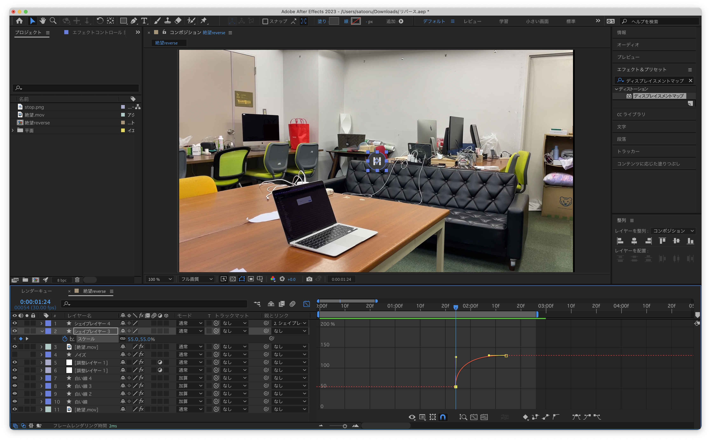

# Open Hack U 2023 NAGOYA

## 出席率
- 3年セミナー：??%

## スケジュール
### 短期的な予定
- [ ] 技育CAMP vol.7(技育展)
  - [x] 案出し
  - [x] 役割分担
  - [x] アプリイメージの作成
  - [x] サイトの作成
  - [x] スライドの作成
  - [x] 技育CAMP vol.7 発表(8/5)
  - [x] 追加開発
  - [x] 技育展中部ブロック 発表(8/12)
  - [ ] デモ動画変更 (システム改善)
  - [ ] 技育CAMPアドバンス 発表(9/2)
  - [ ] 追加開発
  - [ ] 技育展 決勝(9/23)
- [x] HackU NAGOYA
  - [x] 案出し
  - [x] 役割分担
  - [x] キックオフ
  - [x] アプリイメージの作成
  - [x] サイトの作成
  - [x] スライドの作成
  - [x] 発表 (8/27)
- [ ] 端末状態推定
    - [ ] データを取り直す
    - [ ] 加速度と角速度の使い分けタイミングを出す
    - [ ] ー

### 長期的な予定
- 9/23 技育展 決勝

## 進捗報告
## Open Hack U 2023 NAGOYA
### 概要
簡単にアウトプット,
手軽にインプットできるアプリ

[アプリイメージ](https://kjlb.esa.io/posts/4533)

### 自分の担当
- アプリデザイン
- フロントエンド(閲覧, 投稿, 検索ページ)
- 発表スライド/原稿
- 当日の発表

### 発表スライド
<iframe src="https://docs.google.com/presentation/d/e/2PACX-1vRuqeCspR7sKMl35oS5SppyzgdpkSGlv-pd3PqUIKttIFcsCW_sQDY7lmfDj5BPKOOxjOBHOAz3p3vh/embed?start=true&loop=false&delayms=3000" frameborder="0" width="960" height="569" allowfullscreen="true" mozallowfullscreen="true" webkitallowfullscreen="true"></iframe>

## つまずいた点
### API叩いても返ってこない
`axios.post()`  を実行してもリダイレクトを繰り返してエラーを吐く
- 同じ関数を使って別のエンドポイントにリクエストを送ると返ってくる
    - フロント側の問題ではなさそう
- `REST Client` を使うと成功する
    - バック側の問題ではなさそう
    - リクエストの内容もあってそう
- `axios` ではなく `Fetch API` を使っても変化なし
    - ライブラリの問題ではなさそう

#### 結果
**CORS** の問題だった
許可してあげると無事に全てのAPIを叩けるように
（なぜ他のは使えたのかは分からない）

#### 今後の対策
safari では CORS を無視する設定ができる
chromeで CORSエラーをコンソールに出す設定がある

## よかった点
### ドキュメントを残していた
[画面設計](https://kjlb.esa.io/posts/4533) や [API設計](https://kjlb.esa.io/posts/4495)などのドキュメントを残しており、
展示会中にアピールすることができた

### デザインを頑張った
最初の一週間を ~~技育展で手を付けれない代わりに~~ **デザインに掛けた**ことにより、
動作に力を入れるチームが多い中、目立つことができた(と思う)

### デモ用のデータを用意していた
バックの完成前にデモ動画を撮るために
フロント側だけで動作するようにしていた

本番当日、たくさんのショートを投稿したところ
`Cloud Storage` の無料枠の制限に達してしまい読み書きが出来なくなった

展示会では デモ用 を併用することで実際の動作を見せることができた

### 結果
**最優秀賞** をとれた！

## 進路関係
なし

## 余談
### CGつらい

クリックとかドラッグとかが多くて疲れる...
