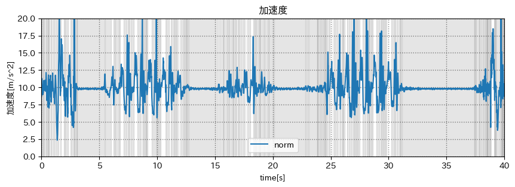
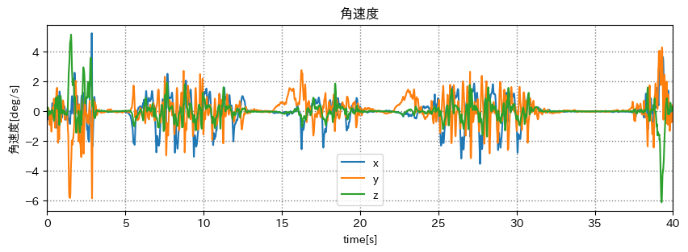
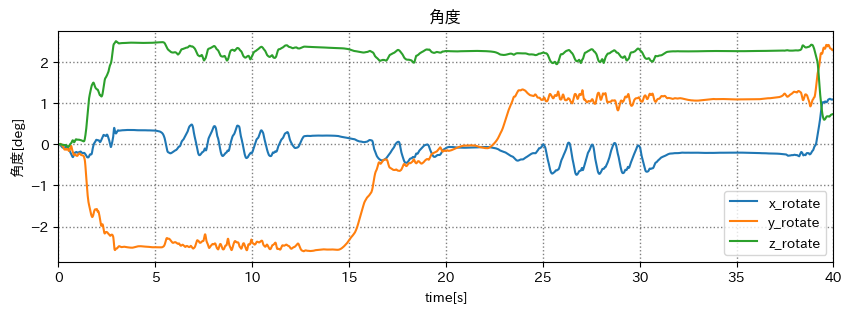
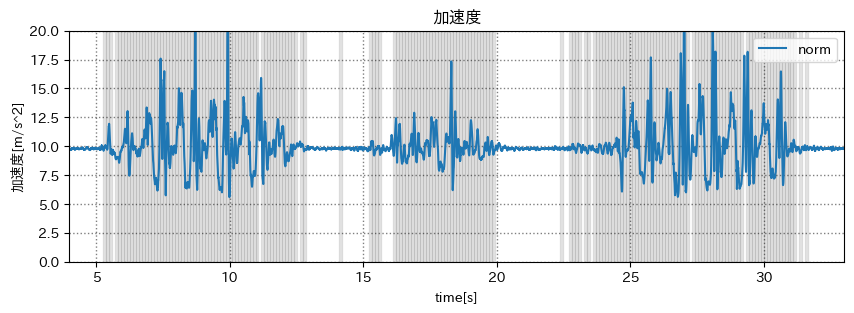
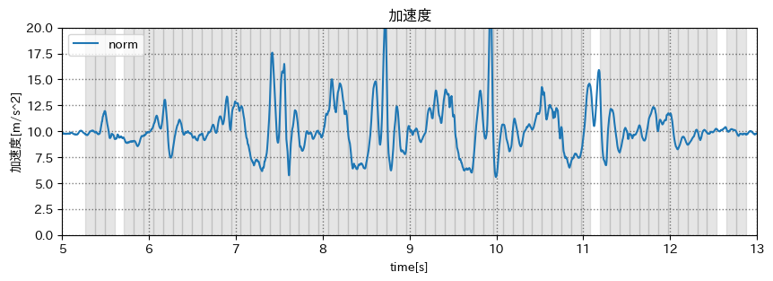
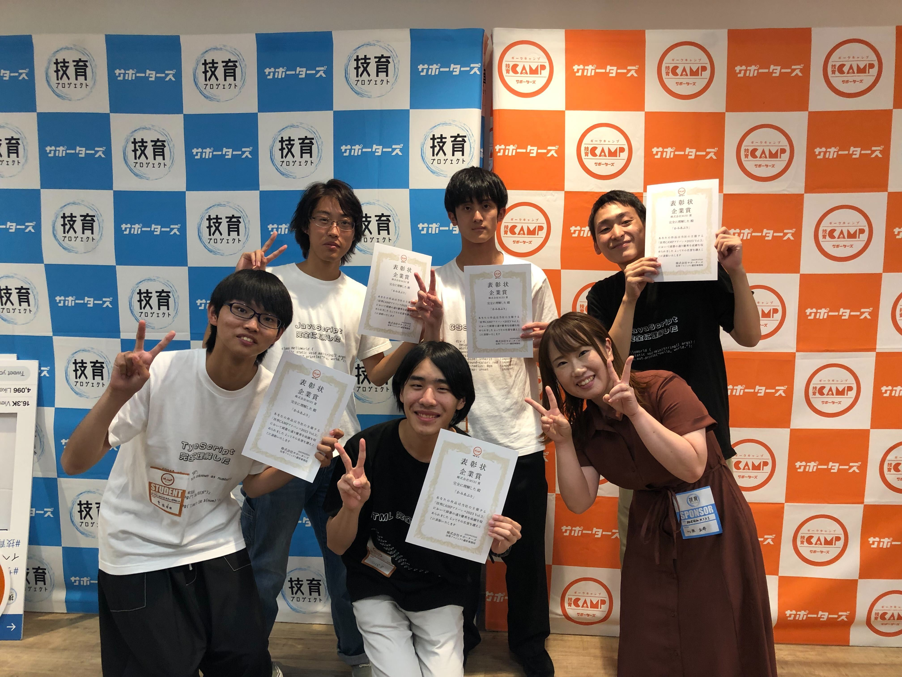

# 技育CAMP アドバンス & 端末状態推定

## 出席率
- 3年セミナー：??%

## スケジュール
### 短期的な予定
- [ ] 技育キャンプ vol.7(技育展)
  - [x] 案出し
  - [x] 役割分担
  - [x] アプリイメージの作成
  - [x] サイトの作成
  - [x] スライドの作成
  - [x] 技育キャンプ vol.7 発表(8/5)
  - [x] 追加開発
  - [x] 技育展中部ブロック 発表(8/12)
  - [ ] デモ動画変更 (システム改善)
  - [ ] 技育CAMPアドバンス 発表(9/2)
  - [ ] 追加開発
  - [ ] 技育展 決勝(9/23)
- 端末状態推定
  - [x] データを収集
  - [x] グラフを作成
  - [ ] ー

### 長期的な予定
- 9/23 技育展 決勝

## 技育CAMP アドバンス
### 制作物
単語の繋がりを可視化するアプリ

### 結果
なし

### 反省
- 技術的な挑戦がない
- 目立たない
- 印象に残らない

## 端末状態推定
### 考え方
- 加速度に変化がない(動いていない)時は、重力加速度の方向から端末状態を出す
- 変化がある時は、ジャイロセンサーから端末状態を出す
- 最終的には `カルマンフィルター` を使う

### データを収集
スマホをポケットに入れてU字に歩く  
> `10歩前進` - `右向いて4歩前進` - `右向いて10歩前進`

<iframe width="439" height="780" src="https://www.youtube.com/embed/76ywptSf5jk" title="端末状態推定 @東京駅" frameborder="0" allow="accelerometer; autoplay; clipboard-write; encrypted-media; gyroscope; picture-in-picture; web-share" allowfullscreen></iframe>

### 加速度(ノルム)

- ~3s : ポケットに入れている
- 37s~ : ポケットから出している

### 角速度

### 角度

### 前回(7/25) のやり方
> ノルム が 9.5(m/s^2) 以上 10.1(m/s^2) 以下の時は、動いていないと判断する  
> (灰色の部分)

### 問題点
歩いている時でも 9.5-10.1(m/s^2) の間になる瞬間がある

### 修正
一定区間の傾きが 0 に近い時は、動いていないと判断する

### 修正後のグラフ

`50ms` ごとに区切って、差が `0.15m/s^2` 以下の時は、動いていないと判断する

### 修正後のグラフ(拡大)

大体は判別できているが、`50ms` の間に山があると判別できない  
→ 前後の差ではなく、区間内の最大値と最小値の差をとる

### 修正後のグラフ2

> 橙は区間内の最大値と最小値の差

`200ms` ごとに区切り、区間内の最大値と最小値の差が `1m/s^2` 以下の時は、  
動いていないと判断する

## 進路関係
なし

## 余談
### ポケGO
東京であまりにも暇だったので久々に ポケGO をやった

消した

### 技育CAMP アドバンス

**株式会社MIXI賞** を頂いた

### Rust
Rust と eframe, egui でデスクトップアプリ作ってみた

<iframe width="880" height="400" src="https://www.youtube.com/embed/Ptb5_1JS6fA" title="Rust (eframe &amp; egui) 2" frameborder="0" allow="accelerometer; autoplay; clipboard-write; encrypted-media; gyroscope; picture-in-picture; web-share" allowfullscreen></iframe>

プログラミング演習の問題をRustで書いてみる(予定)

### 親に進路について言った

> 学費は 公立大学 の分以外が返してもらうけど  
> 好きなようにしたらいんじゃない  

現状: 院進もあり  
まだ慎重に考える

## メモ
分散使ってもよい  
なぜ加速度と角速度を併用するのかなどの説明をもっと  
