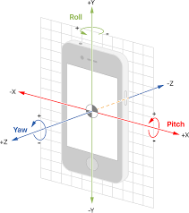

# 端末姿勢推定

## 出席率
- 3年セミナー：??%

## スケジュール
### 短期的な予定
- [ ] 端末姿勢推定
  - [x] データを収集
  - [x] グラフを作成
  - [x] 静止状態の判別
  - [x] 端末の姿勢を推定
  - [ ] 加速度を世界座標に変換
  - [ ] 角速度を世界座標に変換
  - [ ] カルマンフィルターを用いた推定

### 長期的な予定
- 9月23日 技育展 決勝
- 9月中旬まで 端末姿勢推定(加速度, 角速度)
- 10月まで? 端末姿勢推定(カルマンフィルター)
- 10月中 Kotlin(とRust)の勉強 「いつでもセンシングアプリ」

## 進捗
### やりたいこと
端末の姿勢推定  
加速度を端末座標から世界座標にする

### 考え方
- 加速度に変化がない(動いていない)時は、重力加速度の方向から端末状態を出す
- 変化がある時は、ジャイロセンサーから端末状態を出す
- 最終的には `カルマンフィルター` を使う

### 前回


> 灰色は動いていると判断した区間  
> 橙は区間内の最大値と最小値の差

`200ms(80フレーム)` ごとに区切り、区間内の最大値と最小値の差が `1m/s^2` 以下の時は、  
動いていないと判断する

### 静止状態の判別方法を変更
差ではなく、分散を用いる  
`200ms(80フレーム)` ごとに区切り、区間内の分散が `0.15m/s^2` 以下の時は、静止状態とする

### 加速度のグラフ(ノルム)


- 静止状態との差が大きくなっていて良い

### 角速度から端末の傾きを出す
角速度を積分して角度を出す


### 加速度から端末の姿勢を出す
加速度の絶対値で各軸の加速度を割って、arccosをとる
```python
gravity = math.sqrt(x ** 2 + y ** 2 + z ** 2)
angle_x = math.acos(x / gravity)
angle_y = math.acos(y / gravity)
angle_z = math.acos(z / gravity)
```


#### 回転軸の参考


### 加速度と傾きを使い分ける
分散が `0.15m/s^2` 以下の時は、加速度からの傾きを使う  
`0.15m/s^2` 以上の時は、角速度を足して端末の回転を反映させる


- 傾きが大きすぎる
  - ~~角速度を反映時にサンプリング周波数を掛けていない~~
  - 単位が `rad` と `deg` で違った
- より大きな動作(傾き)でやるべき?
  - スマホ持って各軸90度程度回転など

### 修正後


結構理想通りにはなったが正解が分からない
- 加速度を世界座標系に変換する
- 正解データとの比較ができるデータを取る


### 加速度を世界座標系に変換


明らかにおかしい
- ベクトル(加速度)を回転させる関数は以前のものを使用したため合ってるはず
- 元の加速度と姿勢推定後のデータのサンプリング周波数の違い?


## 余談
### キャンプした


センシングした


<iframe width="560" height="315" src="https://www.youtube.com/embed/iwdSV1xFTPM?si=dKs9QrGhYdA8kY-r" title="YouTube video player" frameborder="0" allow="accelerometer; autoplay; clipboard-write; encrypted-media; gyroscope; picture-in-picture; web-share" allowfullscreen></iframe>


### 技育CAMP vol9(工科展)
学校(食堂等)の混雑を知れるアプリ


賞はもらえなかったが、多くの反響をいただけた


### 面談をした
シス研の先輩の紹介で、バイト面談をした

> 案内）Vue と Nestjs を使います
>
> 面談中）バックエンドもやってもらうかも
>
> 終わり）バックエンドがほとんどかな

バックエンドでもいいけど、Rubyを触る気ないんだが...

> 案内）応募しなくても面談もいいですよ
> 
> 僕）応募の前に面談したいです
>
> メール）履歴書出してください
> 
> 面談）合否が決まったら早めに連絡します

言ってること変わるの怖い

愛工大(菱田教授)と関係がありそう
- [情報処理学会 第78回全国大会](https://www.ipsj.or.jp/event/taikai/78/78program/html/aff/a.html)
- [愛総研・研究報告 第17号 2015年](http://repository.aitech.ac.jp/dspace/bitstream/11133/3054/1/%E7%B7%8F%E7%A0%9417%E5%8F%B7(p97-100).pdf)


# メモ
## やったこと
- 最大, 最小から分散に変更
- 加速度から傾きだした
- 姿勢推定した
相補フィルター