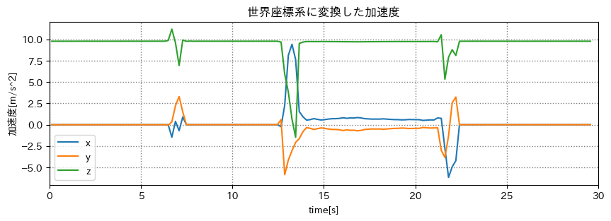

# 端末姿勢推定

## 出席率
- 3年セミナー：??%

## スケジュール
### 短期的な予定
- [ ] 端末姿勢推定
  - [x] データを収集
  - [x] グラフを作成
  - [x] 静止状態の判別
  - [x] 端末の姿勢を推定
  - [x] 加速度を世界座標に変換
  - [ ] カルマンフィルターを用いた推定

### 長期的な予定
- 9月23日 技育展 決勝
- 9月中旬まで 端末姿勢推定(加速度, 角速度)
- 10月まで? 端末姿勢推定(カルマンフィルター)
- 10月中 Kotlin(とRust)の勉強 「いつでもセンシングアプリ」

## 進捗
### やりたいこと
端末の姿勢推定  
加速度を端末座標から世界座標にする

### 考え方
- 相補フィルターを使う
  - 静止状態では加速度から傾きを推定
  - 動作状態では角速度から傾きを推定
- 最終的には `カルマンフィルター` を使う

### 前回) 相補フィルターを使って端末姿勢推定をした


結構理想通りにはなったが正解が分からない
- 加速度を世界座標系に変換してみる
- 正解データとの比較ができるデータを取る

### 前回) 加速度を世界座標系に変換した


明らかにおかしい
- ベクトル(加速度)を回転させる関数は以前のものを使用したため合ってるはず
- 元の加速度と姿勢推定後のデータのサンプリング周波数の違い?

### 問題点1 単位の違い
前回、単位が `rad` と `deg` で違うという問題があった  
→ `deg` に統一

ただし、過去に作ったベクトルを回転させる関数は `rad` だった

#### 修正後のグラフ


### 問題点2 関数が良くない
以前に使った加速度から傾きを出す関数を利用した

#### 関数の仕様
以前のプログラムでは以下の処理をして返していた
```python
def calc_tilt(df_acc):
  ...
    roll = math.acos(x / gravity)
    yaw = math.acos(y / gravity)
    pitch = math.acos(z / gravity)
  ...

# 加速度から傾きを計算
df_tilt = calc_tilt(df_acc)

# 基準に合わせて回転
df_tilt["roll"] = df_tilt["roll"] - math.pi / 2
df_tilt["yaw"] = df_tilt["yaw"] - math.pi / 2
```

今回コピペする上で、`基準に合わせて回転` という処理をしていなかった  
関数の役割的に基準に合わせて回転させる処理は端末の傾きを計算する前に行うべき


### 問題点3 謎の処理
角速度から傾きを出すタイミングの処理で、
1フレーム前との角速度の差分を、1フレーム前の傾きに足していた(?)

自分でもよくわからないが、足してサンプリング周波数で割るように変更

### 修正後のグラフ


世界座標系にはなったが、勢いよく回転させたときに傾きがおかしいが、
妥協点かもしれない

- 急な回転をなくしたデータをとる
  - 歩く-止まる を繰り返しながらスマホを回転させてみる


# メモ
## App Router(Next.js)
- favicon,ogが楽
  - `app/` に置くだけ
  - https://nextjs.org/docs/app/api-reference/file-conventions/metadata/app-icons

pandas merge_asof
(13253, 14)→(13253, 14)

> **方位角（z 軸に関する回転度数）**。これは、端末の現在のコンパス方位と磁北極の間の角度です。端末上部の縁が磁北極を向いているなら方位角は 0 度になります。上部の縁が南を向いているなら方位角は 180 度です。同じように、上部の縁が東を向いているなら方位角は 90 度、上部の縁が西を向いているなら方位角は 270 度です。  
> 
> **勾配（x 軸に関する回転度数）**。これは、端末画面に平行な平面と、地面に平行な平面との間の角度です。端末を地面と平行にして下部の縁を自分のほうに向けた後、端末上部の縁を地面の方に傾けると、勾配角は正になります。反対に端末上部の縁の方が地面から離れるように傾けた場合、勾配角は負になります。値の範囲は -180 度から 180 度までです。  
> 
> **回転（y 軸に関する回転度数）**。これは、端末画面に垂直な平面と、地面に垂直な平面との間の角度です。端末を地面と平行にして下部の縁を自分のほうに向けた後、端末左側の縁を地面の方に傾けると、回転角は正になります。反対に端末右側の縁を地面の方に傾けると、回転角は負になります。値の範囲は -90 度から 90 度までです。

[Android Developers- 端末の画面の向きを計算する](https://developer.android.com/guide/topics/sensors/sensors_position?hl=ja#sensors-pos-orient) より


## バグ修正
### 問題1
- x rad と deg の違い
- x OSによる回転方向の違い
- o rad と deg の違い
  - 角速度を deg/s だと思っていたが rad/s だった
  - それに合わせて加速度から傾きの傾きも deg にしていた
  - 回転させる関数は rad である必要がある

グラフをよく見ると 90度回転させたとき、90前後の値になっていた

### 問題2
```python
df_tilt = calculate_tilt(df_acc)  # 加速度から傾きを計算

# 基準に合わせて回転
df_tilt['roll'] = df_tilt['roll'] - np.radians(90)
df_tilt['pitch'] = df_tilt['pitch'] - np.radians(90)
```

過去のプログラムにおいて、基準に合わせて回転させる処理をしていた。  
しかし、今回 関数しかコピペしていなかったため、基準に合わせて回転させる処理をしていなかった。

一連の処理を関数にまとめなかった理由がわからない。
