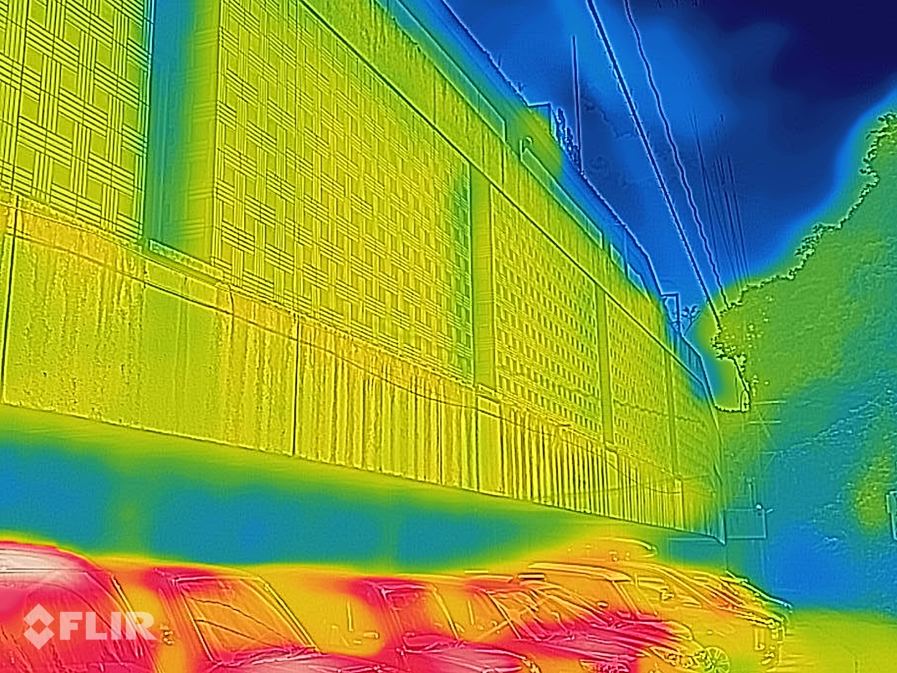
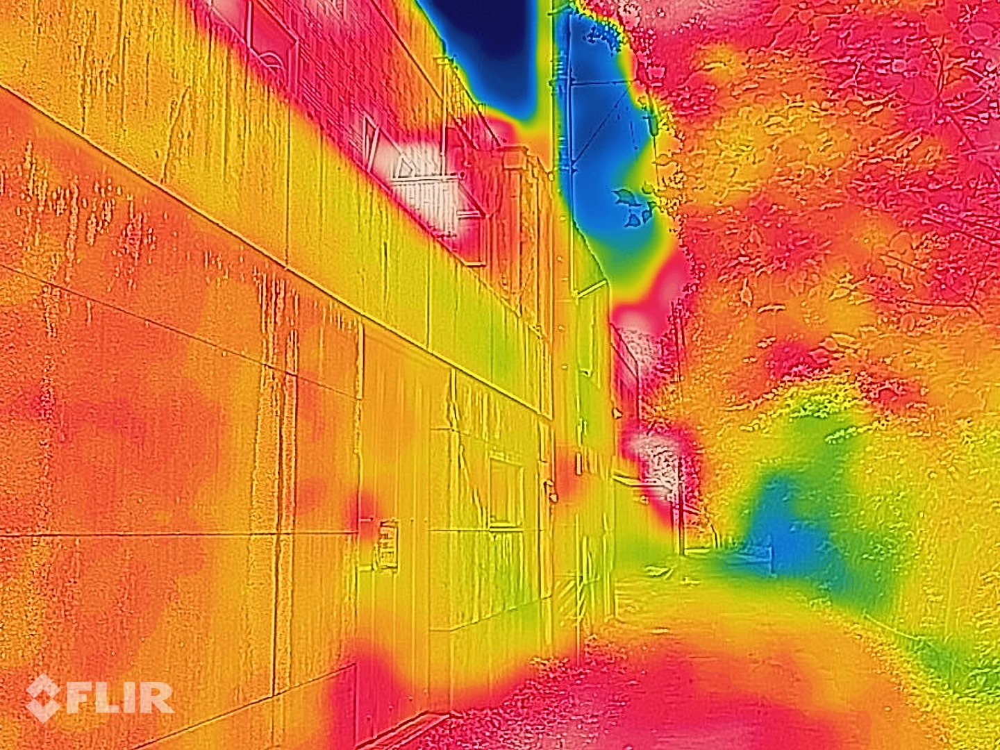
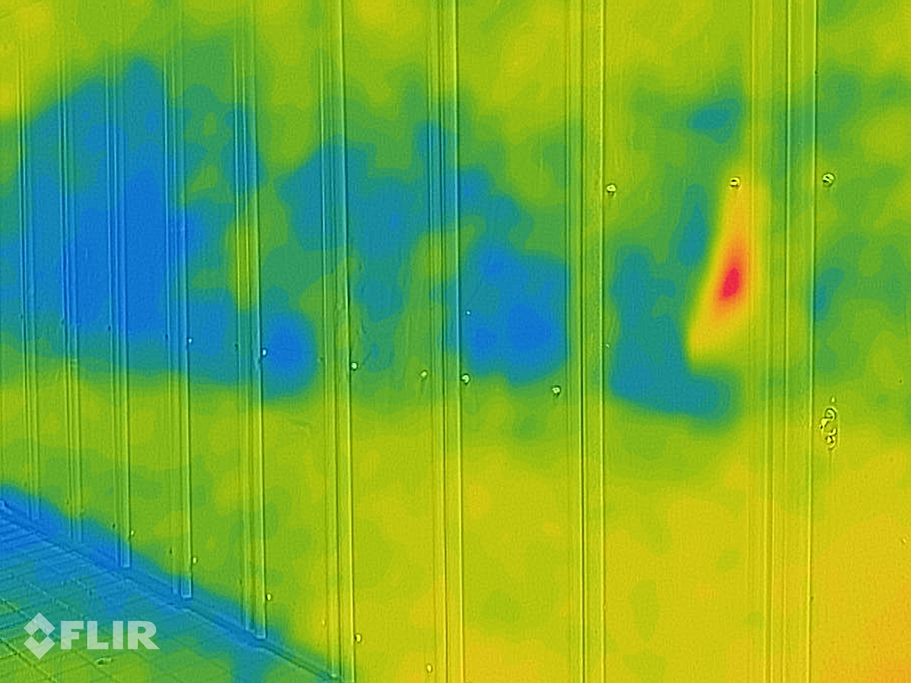

# 技育展 & カルマンフィルタについて調べた

## 出席率
- 3年セミナー：??%

## スケジュール
### 短期的な予定
- [ ] 端末姿勢推定
  - [x] データを収集
  - [x] グラフを作成
  - [x] 静止状態の判別
  - [x] 端末の姿勢を推定
  - [x] 加速度を世界座標に変換
  - [ ] カルマンフィルターを用いた推定
- [x] 技育展 決勝
### 長期的な予定
- 9月中旬まで 端末姿勢推定(加速度, 角速度)
- 10月まで? 端末姿勢推定(カルマンフィルター)
- 10月中 Kotlin(とRust)の勉強 「いつでもセンシングアプリ」

## 進捗報告
## 技育展
### 結果
ファイナリストなれず

### 改善点
- 自分
    - ノードを元にGoogle検索とQiita検索をしやすいように
    - 初めて訪れた際、検索ボックスを表示するようにする
    - ユーザビリティの向上(検索ボックス等)
- その他
    - 2回目以降に訪れた際、最後に見たノードから始まるようにする
    - 関数などより細かな情報を追加

### 感想等
ファイナリストには研究やOSSなど年単位で制作しているものが多く、
気軽に参加してファイナリストになれるものではないと感じた.
しかし、一部のファイナリストや企業賞を取っていた参加者の中には2ヶ月で制作したとうい人も多く、
制作期間だけではなく 技育展に適した アイデアなども重要だと思った.


## 端末姿勢推定
カルマンフィルタについて調べた

### 論文から
CiNii でカルマンフィルタを使っている研究論文を探した

#### GPS測位情報とセンサ情報に基づく位置推定システムに関する研究
[IPSJ](https://ipsj.ixsq.nii.ac.jp/ej/?action=pages_view_main&active_action=repository_view_main_item_detail&item_id=112719&item_no=1&page_id=13&block_id=8)
- Dead Reckoning（DR）技術
  - デッドレコニング
  - カーナビに使われる
- GPSによる絶対位置推定情報とセンサによる相対移動推定情報をカルマンフィルタによって組み合わせる
- 歩数と歩幅は使わない
- 短時間フーリエ変換を用いる
  - 最低2歩分の1s以上がよい

#### 移動体の電波強度を利用した歩行者の位置精度向上手法の評価
[IPSJ](https://ipsj.ixsq.nii.ac.jp/ej/?action=pages_view_main&active_action=repository_view_main_item_detail&item_id=193519&item_no=1&page_id=13&block_id=8)
- 電波強度にカルマンフィルタを適用

#### 測距情報と姿勢情報と部屋情報を融合させた屋内位置推定システムに関する研究
[IPSJ](https://ipsj.ixsq.nii.ac.jp/ej/?action=pages_view_main&active_action=repository_view_main_item_detail&item_id=223525&item_no=1&page_id=13&block_id=8)
- 端末の姿勢情報と周囲の壁面などの測距情報と，屋内の3次元部屋情報を融合する

#### 加速度の時空間情報を考慮した進行方向推定手法の検討
[IPSJ](https://ipsj.ixsq.nii.ac.jp/ej/?action=pages_view_main&active_action=repository_view_main_item_detail&item_id=213021&item_no=1&page_id=13&block_id=8)

論文は専門用語や未知の数学を使っていて難しかった.


### Qiita 等
言いたいことは分かるが、数式が難しく計算方法がわからない

### esa

#### 相補フィルター
相補フィルターにも種類があることを知った
- 固定相補フィルタ
  - どちらか一方を使う
- 可変相補フィルタ
  - 重み係数でどちらも使う
  - 静止時には加速度に重みを、移動時には角速度に重みをおくなど

### Youtube
とても分かりやすかった.
が、プログラムに起こした時の形が見えない

<iframe width="560" height="315" src="https://www.youtube.com/embed/zVAq_3HClGs?si=x7KggOX-ghEp3xRU" title="YouTube video player" frameborder="0" allow="accelerometer; autoplay; clipboard-write; encrypted-media; gyroscope; picture-in-picture; web-share" allowfullscreen></iframe>


### Chat GPT
サンプルコードを生成してもらった.
プログラムから逆に考えてみる

<details><summary>生成したコード</summary><div>

```python
import numpy as np
import pandas as pd

# カルマンフィルターの初期化
def initialize_filter():
    # 初期状態推定値 (クォータニオン)
    x = np.array([1.0, 0.0, 0.0, 0.0])  # 初期の姿勢は単位クォータニオン（姿勢なし）
    
    # 初期推定誤差共分散行列
    P = np.eye(4)

    # プロセスノイズの共分散行列 (システムノイズ)
    Q = np.eye(4) * 0.01  # 適切な値を設定する必要があります

    # 観測ノイズの共分散行列
    R = np.eye(3) * 0.1  # 適切な値を設定する必要があります

    return x, P, Q, R

# クォータニオンを角速度に変換する関数
def quaternion_to_rotation_rate(q, gyro_data):
    q_conj = np.array([q[0], -q[1], -q[2], -q[3]])
    omega = 2.0 * R.from_quat(q_conj).inv().as_rotvec() * gyro_data
    return omega

# カルマンフィルターの更新ステップ
def update_filter(x, P, Q, R, accel_data, gyro_data, dt):
    # 予測ステップ
    A = np.eye(4) + 0.5 * dt * np.array([
        [0, -gyro_data[0], -gyro_data[1], -gyro_data[2]],
        [gyro_data[0], 0, gyro_data[2], -gyro_data[1]],
        [gyro_data[1], -gyro_data[2], 0, gyro_data[0]],
        [gyro_data[2], gyro_data[1], -gyro_data[0], 0]
    ])
    x_pred = A.dot(x)
    P_pred = A.dot(P).dot(A.T) + Q

    # カルマンゲインの計算
    H = np.eye(3)
    K = P_pred.dot(H.T).dot(np.linalg.inv(H.dot(P_pred).dot(H.T) + R))

    # 角速度をクォータニオンに変換
    omega = quaternion_to_rotation_rate(x, gyro_data)

    # 観測更新
    x_updated = x_pred + K.dot(accel_data - H.dot(x_pred))
    P_updated = (np.eye(4) - K.dot(H)).dot(P_pred)

    return x_updated, P_updated

# メインプログラム
if __name__ == "__main__":
    # データをDataFrameから読み込む (仮のデータ)
    data = pd.read_csv('sensor_data.csv')  # ファイル名は実際のファイルに合わせて変更

    # カルマンフィルターの初期化
    x, P, Q, R = initialize_filter()

    # サンプリング時間
    dt = data['timestamp'].diff().mean()

    # データフレームをイテレートし、カルマンフィルターを更新
    for index, row in data.iterrows():
        accel_data = np.array([row['accel_x'], row['accel_y'], row['accel_z']])
        gyro_data = np.array([row['gyro_x'], row['gyro_y'], row['gyro_z']])
        x, P = update_filter(x, P, Q, R, accel_data, gyro_data, dt)

    # 推定された姿勢をクォータニオンからオイラー角に変換
    euler_angles = R.from_quat(x).as_euler('xyz')

    print(f"推定されたロール角度: {euler_angles[0]} rad")
    print(f"推定されたピッチ角度: {euler_angles[1]} rad")
    print(f"推定されたヨー角度: {euler_angles[2]} rad")
```

</div></details>


## 進路関係
なし


## 余談
### 心霊スポット行ってきた
春日井市の **千歳楼**


### サーモグラフィで撮ってみた
幽霊に温もりはあるのか





<iframe width="923" height="692" src="https://www.youtube.com/embed/J8H-u8B1zdY" title="千歳楼(春日井市)" frameborder="0" allow="accelerometer; autoplay; clipboard-write; encrypted-media; gyroscope; picture-in-picture; web-share" allowfullscreen></iframe>

  


# メモ
## [GPS測位情報とセンサ情報に基づく位置推定システムに関する研究](https://ipsj.ixsq.nii.ac.jp/ej/?action=pages_view_main&active_action=repository_view_main_item_detail&item_id=112719&item_no=1&page_id=13&block_id=8)
- Dead Reckoning（DR）技術
  - デッドレコニング
  - カーナビに使われる
- GPSによる絶対位置推定情報とセンサによる相対移動推定情報をカルマンフィルタによって組み合わせる
- 歩数と歩幅は使わない
- 短時間フーリエ変換を用いる
  - 最低2歩分の1s以上がよい

## [移動体の電波強度を利用した歩行者の位置精度向上手法の評価](https://ipsj.ixsq.nii.ac.jp/ej/?action=pages_view_main&active_action=repository_view_main_item_detail&item_id=193519&item_no=1&page_id=13&block_id=8)
- 電波強度にカルマンフィルタを適用

## [測距情報と姿勢情報と部屋情報を融合させた屋内位置推定システムに関する研究](https://ipsj.ixsq.nii.ac.jp/ej/?action=pages_view_main&active_action=repository_view_main_item_detail&item_id=223525&item_no=1&page_id=13&block_id=8)
- 端末の姿勢情報と周囲の壁面などの測距情報と，屋内の3次元部屋情報を融合する

## [加速度の時空間情報を考慮した進行方向推定手法の検討](https://ipsj.ixsq.nii.ac.jp/ej/?action=pages_view_main&active_action=repository_view_main_item_detail&item_id=213021&item_no=1&page_id=13&block_id=8)


# 単語帳
## Pedestrian Dead Reckoning


## Dead Reckoning（DR）技術
> ある位置から相対的な移動を加速度センサや地磁気センサなどのセンサ群によって測定

### DR と カルマンフィルタ
ChatGPTより
> Dead Reckoning（DR）技術 と カルマンフィルタの関係性を教えて
> 
> Dead Reckoningは、センサーデータを使用して位置や姿勢を推定しますが、センサーデータにはノイズや誤差が含まれることがあります。カルマンフィルタは、これらの誤差を補正し、より信頼性の高い位置や姿勢の推定を提供します。

https://wagtail.cds.tohoku.ac.jp/coda/python/stochastic-methods/kalman-filter-1.html

https://kjlb.esa.io/posts/595

- 相補フィルタ
  - 固定相補フィルタ
    - どちらか一方を使う
  - 可変相補フィルタ
    - 重み係数でどちらも使う
    - 静止時には加速度に重みを、移動時には角速度に重みをおく
- パーティクルフィルタ
- カルマンフィルタ
  - カルマンフィルタは、ノイズの含まれている観測値から内部状態(ノイズが含まれていない値)を推定できる
    - [ogane 2020/06/09](https://kjlb.esa.io/posts/803#%E3%82%AB%E3%83%AB%E3%83%9E%E3%83%B3%E3%83%95%E3%82%A3%E3%83%AB%E3%82%BF)
  - 前回推定値と観測値を元に今回値を推定する逐次推定型
  - 線形カルマンフィルタ
  - 非線形カルマンフィルタ
    - 拡張カルマンフィルタ
- 状態変数(加速度, 角速度等)から観測値を推定する

https://www.youtube.com/watch?v=zVAq_3HClGs
16:29