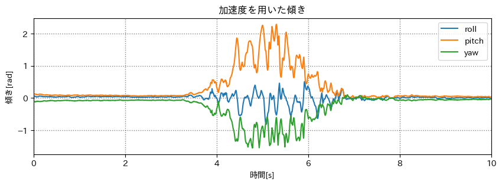

# カルマンフィルタ序章

## 出席率
- 3年セミナー：??%

## スケジュール
### 短期的な予定
- [ ] 端末姿勢推定
  - [x] データを収集
  - [x] グラフを作成
  - [x] 静止状態の判別
  - [x] 端末の姿勢を推定
  - [x] 加速度を世界座標に変換
  - [ ] カルマンフィルタを用いた推定
### 長期的な予定
- 9月中旬まで 端末姿勢推定(加速度, 角速度)
- 10月中 端末姿勢推定(カルマンフィルタ)
- 11月中 Kotlin(とRust)の勉強 「いつでもセンシングアプリ」

## 進捗報告
### データをとる
回転を滑らかにしたデータを取る

`机に置く(z軸正が上)` → `縦向きに立てる(y軸正が上)` → `横向きに立てる(x軸正が上)` → `机に置く(z軸正が上)`

<iframe width="439" height="780" src="https://www.youtube.com/embed/yJg3MZElUmc" title="歩く + スマホ回転" frameborder="0" allow="accelerometer; autoplay; clipboard-write; encrypted-media; gyroscope; picture-in-picture; web-share" allowfullscreen></iframe>

### 元データ
#### 加速度


> 白: 静止時  
> 灰: 動作時  

#### 角速度, 角度


#### 姿勢推定結果


うまくいっているように見えるが、角速度のメリットが分かりづらい


#### 加速度だけを使用した姿勢推定


#### 世界座標系に変換した加速度


### 加速度を大きくする
小走りしながらスマホを立てて戻す

<iframe width="439" height="780" src="https://www.youtube.com/embed/yJg3MZElUmc" title="歩く + スマホ回転" frameborder="0" allow="accelerometer; autoplay; clipboard-write; encrypted-media; gyroscope; picture-in-picture; web-share" allowfullscreen></iframe>


#### 加速度だけを使用した姿勢推定


#### 相補フィルターを用いた姿勢推定


加速度だけではノイズが大きいが、
相補フィルターではノイズを抑えることができている


### カルマンフィルタ
もっと調べた

#### Youtube
<iframe width="1165" height="655" src="https://www.youtube.com/embed/Y5SXsgarjAg" title="【数分解説】カルマンフィルタ  : ノイズを考慮してリアルタイムに直接観測できない状態を推定したい【Kalman FIlter】" frameborder="0" allow="accelerometer; autoplay; clipboard-write; encrypted-media; gyroscope; picture-in-picture; web-share" allowfullscreen></iframe>


#### ChatGPT に生成させたサンプルコード
<details><summary>生成したコード</summary><div>

```python
import numpy as np
import pandas as pd

# カルマンフィルタの初期化
def initialize_filter():
    # 初期状態推定値 (クォータニオン)
    x = np.array([1.0, 0.0, 0.0, 0.0])  # 初期の姿勢は単位クォータニオン（姿勢なし）
    
    # 初期推定誤差共分散行列
    P = np.eye(4)

    # プロセスノイズの共分散行列 (システムノイズ)
    Q = np.eye(4) * 0.01  # 適切な値を設定する必要があります

    # 観測ノイズの共分散行列
    R = np.eye(3) * 0.1  # 適切な値を設定する必要があります

    return x, P, Q, R

# クォータニオンを角速度に変換する関数
def quaternion_to_rotation_rate(q, gyro_data):
    q_conj = np.array([q[0], -q[1], -q[2], -q[3]])
    omega = 2.0 * R.from_quat(q_conj).inv().as_rotvec() * gyro_data
    return omega

# カルマンフィルタの更新ステップ
def update_filter(x, P, Q, R, accel_data, gyro_data, dt):
    # 予測ステップ
    A = np.eye(4) + 0.5 * dt * np.array([
        [0, -gyro_data[0], -gyro_data[1], -gyro_data[2]],
        [gyro_data[0], 0, gyro_data[2], -gyro_data[1]],
        [gyro_data[1], -gyro_data[2], 0, gyro_data[0]],
        [gyro_data[2], gyro_data[1], -gyro_data[0], 0]
    ])
    x_pred = A.dot(x)
    P_pred = A.dot(P).dot(A.T) + Q

    # カルマンゲインの計算
    H = np.eye(3)
    K = P_pred.dot(H.T).dot(np.linalg.inv(H.dot(P_pred).dot(H.T) + R))

    # 角速度をクォータニオンに変換
    omega = quaternion_to_rotation_rate(x, gyro_data)

    # 観測更新
    x_updated = x_pred + K.dot(accel_data - H.dot(x_pred))
    P_updated = (np.eye(4) - K.dot(H)).dot(P_pred)

    return x_updated, P_updated

# メインプログラム
if __name__ == "__main__":
    # データをDataFrameから読み込む (仮のデータ)
    data = pd.read_csv('sensor_data.csv')  # ファイル名は実際のファイルに合わせて変更

    # カルマンフィルタの初期化
    x, P, Q, R = initialize_filter()

    # サンプリング時間
    dt = data['timestamp'].diff().mean()

    # データフレームをイテレートし、カルマンフィルタを更新
    for index, row in data.iterrows():
        accel_data = np.array([row['accel_x'], row['accel_y'], row['accel_z']])
        gyro_data = np.array([row['gyro_x'], row['gyro_y'], row['gyro_z']])
        x, P = update_filter(x, P, Q, R, accel_data, gyro_data, dt)

    # 推定された姿勢をクォータニオンからオイラー角に変換
    euler_angles = R.from_quat(x).as_euler('xyz')

    print(f"推定されたロール角度: {euler_angles[0]} rad")
    print(f"推定されたピッチ角度: {euler_angles[1]} rad")
    print(f"推定されたヨー角度: {euler_angles[2]} rad")
```

</div></details>

<details><summary>整形, デバッグ, コメントを追加したコード</summary><div>

```python
import numpy as np
import pandas as pd
import matplotlib.pyplot as plt
from scipy.spatial.transform import Rotation


def initialize_filter():
    """
    カルマンフィルターを初期化する
    P, Q, R は適切な値を設定する必要がある
    """

    # 初期状態推定値 (クォータニオン)
    # 初期の姿勢は単位クォータニオン（姿勢なし）
    x = np.array([1.0, 0.0, 0.0, 0.0])

    # 初期推定誤差共分散行列
    P = np.eye(4)

    # プロセスノイズの共分散行列
    Q = np.eye(4) * 0.01

    # 観測ノイズの共分散行列
    R = np.eye(3) * 0.1

    return x, P, Q, R


def quaternion_to_rotation_rate(q, gyro_data):
    """
    クォータニオンを角速度に変換する

    Args:
        q (np.array): クォータニオン
        gyro_data (np.array): ジャイロセンサーの値
    """

    # クォータニオンの共役を計算
    # ax + bi (iは虚数)の共役は ax - bi みたいな感じ
    q_conj = np.array([q[0], -q[1], -q[2], -q[3]])

    # クォータニオンを回転ベクトルに変換
    # 2倍するのは、回転ベクトルの長さが角速度になるようにするため
    # 逆回転のためにinv()を使う
    # inv で逆行列を求める
    # as_rotvec で回転ベクトルに変換
    # gyro_data で回転ベクトルの長さを決める
    omega = 2.0 * Rotation.from_quat(q_conj).inv().as_rotvec() * gyro_data
    return omega


def update_filter(x, P, Q, R, accel_data, gyro_data, dt):
    """
    カルマンフィルターを更新する

    Args:
        x (np.array): 状態推定値
        P (np.array): 推定誤差共分散行列
        Q (np.array): プロセスノイズの共分散行列
        R (np.array): 観測ノイズの共分散行列
        accel_data (np.array): 加速度センサーの値
        gyro_data (np.array): ジャイロセンサーの値
        dt (float): サンプリング時間
    """

    # 予測ステップ
    x_gyro = gyro_data[0]
    y_gyro = gyro_data[1]
    z_gyro = gyro_data[2]

    # 角速度を表す行列
    omega = np.array([
        [0     , -x_gyro, -y_gyro, -z_gyro],
        [x_gyro,       0,  z_gyro, -y_gyro],
        [y_gyro, -z_gyro,       0,  x_gyro],
        [z_gyro,  y_gyro, -x_gyro,       0]
    ])

    # np.eye(4) は 4x4 の単位行列を生成する
    # 0.5 はサンプリング時間の半分
    # dt はサンプリング時間
    A = np.eye(4) + (0.5 * dt * omega)
    del omega

    # 角速度xサンプリング時間 を掛けることで予測値を求める
    x_pred = A.dot(x)
    P_pred = A.dot(P).dot(A.T) + Q

    # カルマンゲインの計算
    # 3x4のゼロ行列を作成
    H = np.zeros((3, 4))

    # H行列の適切な要素に値を設定
    H[0, 1] = 1  # x方向の加速度とx軸回りの姿勢の関係
    H[1, 2] = 1  # y方向の加速度とy軸回りの姿勢の関係
    H[2, 3] = 1  # z方向の加速度とz軸回りの姿勢の関係

    # カルマンゲインを求める
    K = P_pred.dot(H.T).dot(np.linalg.inv(H.dot(P_pred).dot(H.T) + R))

    # 角速度をクォータニオンに変換
    omega = quaternion_to_rotation_rate(x, gyro_data)

    # 観測更新
    # 状態推定値(x_pred) と カルマンゲイン(K) を足す
    x_updated = x_pred + K.dot(accel_data - H.dot(x_pred))
    P_updated = (np.eye(4) - K.dot(H)).dot(P_pred)

    return x_updated, P_updated


# メインプログラム
if __name__ == "__main__":
    # データをDataFrameから読み込む (Accelerometer.csv と Gyroscope.csv に変更)
    file_path = "./logs/run_kururu/"
    accel_data = pd.read_csv(f'{file_path}Accelerometer.csv')
    gyro_data = pd.read_csv(f'{file_path}Gyroscope.csv')

    # カルマンフィルターの初期化
    x, P, Q, R = initialize_filter()

    # サンプリング時間
    dt = accel_data['Time (s)'].diff().mean()

    # データフレームをイテレートし、カルマンフィルターを更新
    length = accel_data.shape[0] if accel_data.shape[0] < gyro_data.shape[0] else gyro_data.shape[0]

    datum = []
    for index in range(length - 1):
        accel_data_point = np.array([
            accel_data.at[index, 'Acceleration x (m/s^2)'],
            accel_data.at[index, 'Acceleration y (m/s^2)'],
            accel_data.at[index, 'Acceleration z (m/s^2)']
        ])
        gyro_data_point = np.array([
            gyro_data.at[index, 'Gyroscope x (rad/s)'],
            gyro_data.at[index, 'Gyroscope y (rad/s)'],
            gyro_data.at[index, 'Gyroscope z (rad/s)']
        ])
        x, P = update_filter(x, P, Q, R, accel_data_point, gyro_data_point, dt)

        # 推定された姿勢をクォータニオンからオイラー角に変換
        euler_angles = Rotation.from_quat(x).as_euler('xyz')
        datum.append([euler_angles[0], euler_angles[1], euler_angles[2]])

    # datumをプロット
    datum = np.array(datum)
    plt.plot(datum[:, 0], label='roll')
    plt.plot(datum[:, 1], label='pitch')
    plt.plot(datum[:, 2], label='yaw')
    plt.legend()
    plt.show()
```

</div></details>


### カルマンフィルタのイメージ
1フレーム前の状態と観測値から、現在の状態を推定する
うまく計算してだされた値(カルマンゲイン)と推定値を使って、現在の状態を更新する


### カルマンフィルタの流れ
1. 初期化
   - 初期状態推定値を設定
     - 姿勢なし: [0, 0, 0, 0]
   - 初期推定誤差共分散行列を設定
   - プロセスノイズの共分散行列を設定
   - 観測ノイズの共分散行列を設定
2. 予測する
   - 前回の状態推定値 と 角速度xサンプリング周波数 を使って計算する
3. カルマンゲインを計算する
   - 予測推定誤差 と 観測ノイズの共分散行列 を使って計算する
4. 観測を更新する
   - 姿勢(x) を更新する
     - 推定値(x_pred) と カルマンゲイン(K) を足す
   - 推定誤差(P) を更新する
     - カルマンゲイン と 予測推定誤差を使って計算する
5. (1フレーム進んで2へ戻る)


#### クォータニオン
クォータニオンは 回転を表す4次元のベクトル.  
複素数を4次元に拡張したもの.

複素数 i に加えて j も追加したイメージ

数列: 1次元(線)  
複素数: 2次元(平面)
クォータニオン?: 3次元(空間)

[クォータニオン](https://techblog.sega.jp/entry/2021/06/15/100000)

#### 状態推定値
端末の状態(姿勢)の クォータニオン

#### 初期推定誤差
推定値と実際の値との間に生じる誤差  
なぜそれを求めれるのかがわからない

#### プロセスノイズ
システムやプロセスの挙動や状態に影響を与える外部からのランダムな要因や摂動のこと  
ex) 摩擦や風の影響、車両の制御システムの誤差など

行列でどう表現しているのかがわからない

#### 観測ノイズ
センサで計測した値に生じる誤差

行列でどう表現しているのかがわからない


### カルマンフィルタを用いた姿勢推定結果


わからない.


## 進路関係
なし


## 余談
### お月見どろぼう


近所の子供達がいろんな家を回ってお菓子を盗む(合法)イベント.  
ルールが増えてきて残念..って感じだが、伝統が残っていて良いと思う.


### mocopi で遊んでみた


<iframe width="439" height="780" src="https://www.youtube.com/embed/8tCowWe5H-8" title="mocopi であそぼ バーチャル @名電" frameborder="0" allow="accelerometer; autoplay; clipboard-write; encrypted-media; gyroscope; picture-in-picture; web-share" allowfullscreen></iframe>

思ったより手軽で精度も高かった.  
データを取り出したりして遊んでみたい.

旅行の必需品

# メモ
次週Unity触る

カルマンフィルタはもっと一般的なところから勉強し、
説明できるようになる