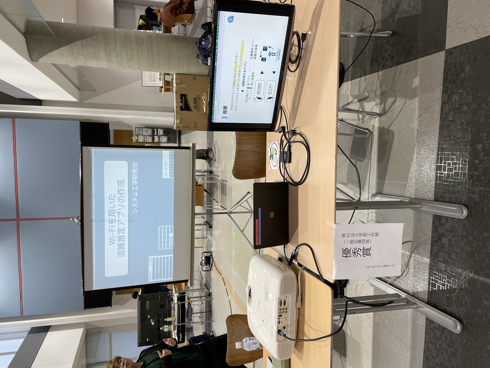
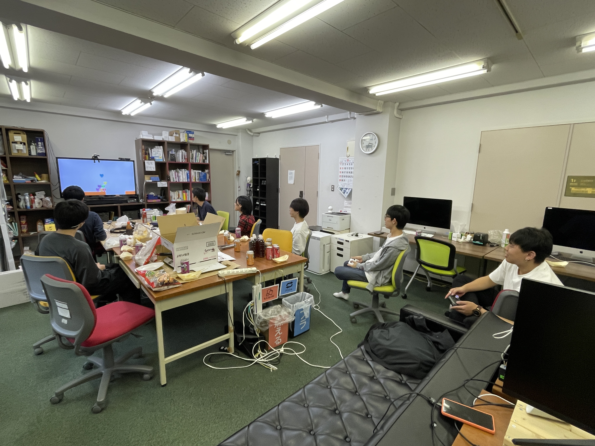

# 工科展

## 出席率
- 3年セミナー：??%

## スケジュール
### 短期的な予定
- [ ] 端末姿勢推定
  - [x] データを収集
  - [x] グラフを作成
  - [x] 静止状態の判別
  - [x] 端末の姿勢を推定
  - [x] 加速度を世界座標に変換
  - [ ] Unity で可視化
  - [ ] カルマンフィルタを用いた推定
### 長期的な予定
- 9月中旬まで 端末姿勢推定(加速度, 角速度)
- 10月中 端末姿勢推定(カルマンフィルタ)
- 11月中 Kotlin(とRust)の勉強 「いつでもセンシングアプリ」

## 進捗
## 工科展
### 制作物
大学内の施設や教室の混雑を知れるアプリ

<iframe src="https://campuscrowdmonitor.vercel.app/" width="100%" height="500px"></iframe>

### 技術
- フロント
  - Next.js
- バック
  - Go
  - Gin
  - Gorm
  - ipv4
  - smtp

### 結果
優秀賞をいただいた

### 展示中の様子

### 感想
ネットワークつよつよな方が来たりしたが、
全ての質問に対して回答とスライドを用意しており、
完璧に対応できたのが良かった.

チームが崩壊しており、牧野先輩・林先輩に助けを求めてなんとか完成させており、
自分たちでできなかったという点ではPMとして良くなかった。

## 余談
### 学祭で模擬店をやった

牧野先輩に買わせた韓国のサイダーがめっちゃ売れた

売れ残りのたこ焼きを食べながらタコパした
