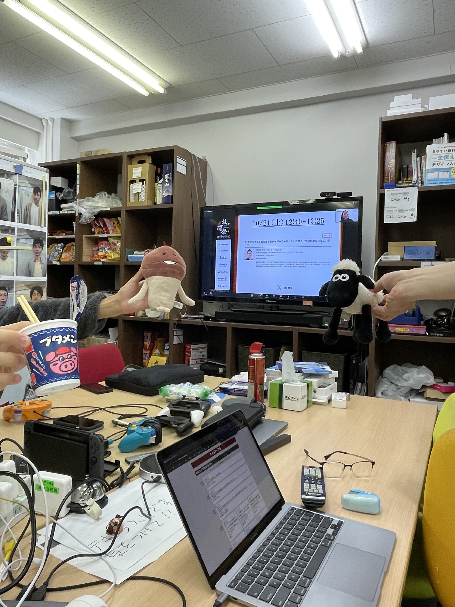
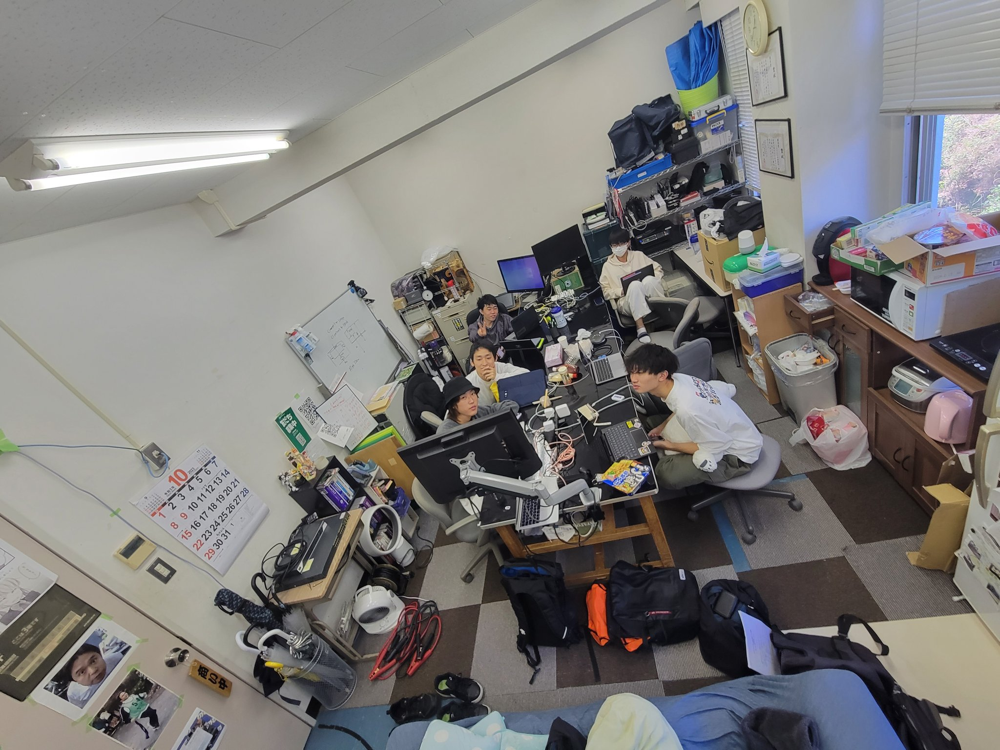

# mocopi センシング

## 出席率
- 3年セミナー：??%

## スケジュール
### 短期的な予定
- [ ] mocopi でセンシング
  - [x] mocopi x Unity
  - [x] 色んな動作をとる
  - [x] 誤差を計測(簡易)
  - [ ] csv に書き出せるアプリを作る
  - [ ] 動作判別
- [ ] Androidアプリ開発
### 長期的な予定
- 1月~ 研究
- 12月 WiNF2024

## 進捗
### mocopi x Unity
参考: [EVMC4UでUnityとバーチャルモーションキャプチャーをつなぐ方法 | STYLY](https://styly.cc/ja/tips/evmc4u_rapturn_virtualmotioncapture/)

1. mocopi(本体) -[Bluetooth]→ mocopi(アプリ)
2. mocopi(アプリ) -[UDP]→ Python(mcp-reciever)
3. Python(mcp-reciever) -[VMC]→ Unity

#### リアルタイムでUnityで可視化
<iframe width="1180" height="647" src="https://www.youtube.com/embed/m-bYzkfMnqI" title="mocopi x Unity 1" frameborder="0" allow="accelerometer; autoplay; clipboard-write; encrypted-media; gyroscope; picture-in-picture; web-share" allowfullscreen></iframe>

### 色んな動作をとる

#### 足踏み,逆立ち
<iframe width="1180" height="664" src="https://www.youtube.com/embed/yv6wS2w80Qw" title="mocopi x Unity 足踏み,逆立ち" frameborder="0" allow="accelerometer; autoplay; clipboard-write; encrypted-media; gyroscope; picture-in-picture; web-share" allowfullscreen></iframe>

#### 腹筋,腕立て
<iframe width="1180" height="664" src="https://www.youtube.com/embed/d6J1ZBgpcX8" title="mocopi x Unity 腹筋,腕立て" frameborder="0" allow="accelerometer; autoplay; clipboard-write; encrypted-media; gyroscope; picture-in-picture; web-share" allowfullscreen></iframe>

<iframe width="442" height="786" src="https://www.youtube.com/embed/GSjpq5YWks8" title="mocopi x Unity 腹筋,腕立て(現実)" frameborder="0" allow="accelerometer; autoplay; clipboard-write; encrypted-media; gyroscope; picture-in-picture; web-share" allowfullscreen></iframe>

#### 素振り,剣道
<iframe width="1180" height="664" src="https://www.youtube.com/embed/lsaWs5ELnBA" title="mocopi x Unity 素振り, 剣道" frameborder="0" allow="accelerometer; autoplay; clipboard-write; encrypted-media; gyroscope; picture-in-picture; web-share" allowfullscreen></iframe>

<iframe width="442" height="786" src="https://www.youtube.com/embed/-X8t4r4ZtoM" title="mocopi x Unity 素振り,剣道(現実)" frameborder="0" allow="accelerometer; autoplay; clipboard-write; encrypted-media; gyroscope; picture-in-picture; web-share" allowfullscreen></iframe>

### 誤差を計測(簡易)
#### 30m歩く
<iframe width="442" height="786" src="https://www.youtube.com/embed/sE-lX1Xa-qk" title="mocopi 誤差計測 30m" frameborder="0" allow="accelerometer; autoplay; clipboard-write; encrypted-media; gyroscope; picture-in-picture; web-share" allowfullscreen></iframe>

<iframe width="442" height="786" src="https://www.youtube.com/embed/5AFtMsRQZOk" title="mocopi 誤差計測 30m(現実)" frameborder="0" allow="accelerometer; autoplay; clipboard-write; encrypted-media; gyroscope; picture-in-picture; web-share" allowfullscreen></iframe>

#### 計測方法・結果
- 実際に30m歩く
- 歩きつつ mocopi(アプリ) 内のグリッドを数える

30m歩いたところ、バーチャルでは29m歩いたことになった  
外で100mくらい歩いて誤差を計測したい

### 計測アプリを作る
既存のアプリ等の問題点
- 扱いづらい
  - PC側が受信(Python)と表示(Unity)で分かれている
- csv書き出し未対応
  - Pythonに追加すれば良いが、扱いづらい
- 移動距離等が分かりづらい
  - グリッドを数える必要がある

#### 技術
- Tauri
  - Rust (受信側)
  - Next.js (表示側)

#### 表示とアニメーションができた
ブラウザ上で動くようにした
<iframe width="1180" height="664" src="https://www.youtube.com/embed/3BUVaL_y07E" title="web x vrmモデル 歩かせてみた" frameborder="0" allow="accelerometer; autoplay; clipboard-write; encrypted-media; gyroscope; picture-in-picture; web-share" allowfullscreen></iframe>

三角関数で円形に動くアニメーションを作った  
→ UDPで受信したデータを元に動かすようにする

破壊的変更により今までの情報がほとんど使えず、
公式ドキュメントを読みながら制作した

Next: Rust でUDPを取得する

### mocopi の問題点
- 激しい動きをすると狂う
- 精度が完璧ではない
    - 手先の位置
    - 肘・膝の曲げ具合
    - 座った時の体の傾き
    - 足を上に上げたとき不安定

### 今後mocopiでやりたいこと
- 長距離歩いた時の誤差
  - もっとしっかり取りたい 100m とか
- グラウンドぐるぐる歩いた時の誤差をとりたい
- 走たときはどうなるか
- 素振り, 着席時の動作判別
- 2人以上の絡みをとりたい
  - 馬跳
  - 組体操

## 余談
### 技育祭をみた
土日にシス研で集まってみた

#### 1日目

#### 2日目

# メモ
[ドキュメント](https://www.sony.net/Products/mocopi-dev/jp/)
