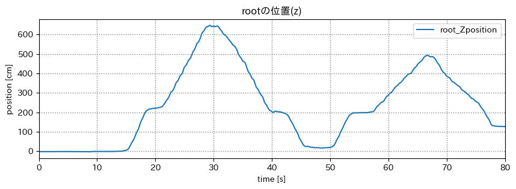

# mocopi センシング

## スケジュール
### 短期的な予定
- [ ] mocopi でセンシング
  - [x] mocopi x Unity
  - [x] 色んな動作をとる
  - [x] 誤差を計測(簡易)
  - [x] 動作をグラフ化
  - [ ] bvhをパースするパッケージを作る
  - [ ] 動作判別
  - [ ] csv に書き出せるアプリを作る
- [ ] 研究をしたい
  - [ ] テーマを考える
  - [ ] 研究する
  - [ ] 論文を書く
  - [ ] 発表する
### 長期的な予定
- 1月~ 研究
- 12月 WiNF2024

## 進捗
### 階段の上り下り
4号館別館の3階から2階へ下りて、上る

#### 経路


#### 位置





#### 気圧


階段を上ったのに気圧にあまり変化がない  
→ ポケットに入れていたから?

撮り直す

#### 経路


#### 位置


#### 気圧


#### 加速度のノルムとピーク


#### 位置yと加速度のノルムのピーク


### ジャンプ
3回 + 1回 + 1回
#### y軸の位置


### 結果
rootの位置(y)は、地面を基準としている

階段を上り下りすると、基準が変わり補正が掛かる

手足がついた瞬間に基準が変わり、補正されるため、  
ジャンプ中や、一歩を踏み出している時は基準が変わらない

平面空間であれば取れるが、上下する階段やエレベーター等の判別は難しそう

何やればいいか迷走してます


### bvhをパースするパッケージを作る
現状、bvhをパースするパッケージはないため、自作する

各関節は相対的な位置・角度で表されているため扱いづらい  
→ 簡単に絶対的な位置・角度を取得できるようにする

#### 結果
2行で取得できるようになった
```python
# ファイルを指定
bvhp = BVHparser('sample/jump.bvh')

# 欲しい関節を指定
absolute_motion_df = bvhp.getAbsoluteMotionDataframe('r_toes')
```


#### やりたいこと
- 関節の位置関係をベタ書きではなく、ファイルから取得できるようにする
- モーションのチャンネルをファイルから取得できるようにする
- 初期の位置を変更できるようにする
- 初期の骨格同士のオフセットをファイルから取得できるようにする
- 初期の骨格のオフセットを変更できるようにする


#### 下半身優先
太もも用拡張バンドが無償提供されるらしい

https://www.sony.jp/mocopi/info/20231106.html


### 研究を考えたい
#### おもちゃをもらった


夢が詰まってる

togawaさんから滞在ウォッチについて聞いた。  
やりたいところがほぼ終わってた  
物理ビーコンのセキュリティ(uuidが変わらない)というところは面白そう  
これは3年生の研究?


#### ブルーシートばたばたするやつ
使い道が思いつかない

<iframe width="560" height="315" src="https://www.youtube.com/embed/iwdSV1xFTPM?si=dKs9QrGhYdA8kY-r" title="YouTube video player" frameborder="0" allow="accelerometer; autoplay; clipboard-write; encrypted-media; gyroscope; picture-in-picture; web-share" allowfullscreen></iframe>

#### ライブセンシング
ドラゴンナイト中の動き


- 撮影禁止の代わりにその時の自分の様子を残す
  - mocopi で全身をとる
    - 詳細に残せる
    - 手軽さがない
  - スマホ で何種類か推定
    - 大まかにしか推定できない
    - 手軽
- その場の盛り上がりをみんなで共有
  - その場のひとたちで何か
  - マップ上でぴょんぴょんしてる様子をみる
- 主催者が盛り上がりを見る?
  - ペンライトを制御する感じで何か


## 余談
### エディターを色々試してる
#### Zed


- 起動がはやい
- 多分Rust(Tauri)製のエディター
- デフォルトではvimバインド
- 拡張機能は無い

#### Lapce


- 起動がとてもはやい
- 完全にRust製のエディター
- デフォルトではvimバインド
- 拡張機能がある(Rust製)


### シス研のサイトを作った(てる)
<iframe src="https://sysken.net/" width="100%" height="500px"></iframe>

esaをCMSとして投稿・編集できるようにした  


パフォーマンスを100にしたい


# メモ
## TODO
- 直角, 並行から歩行軌跡を綺麗に
- 建物のマップを元に
