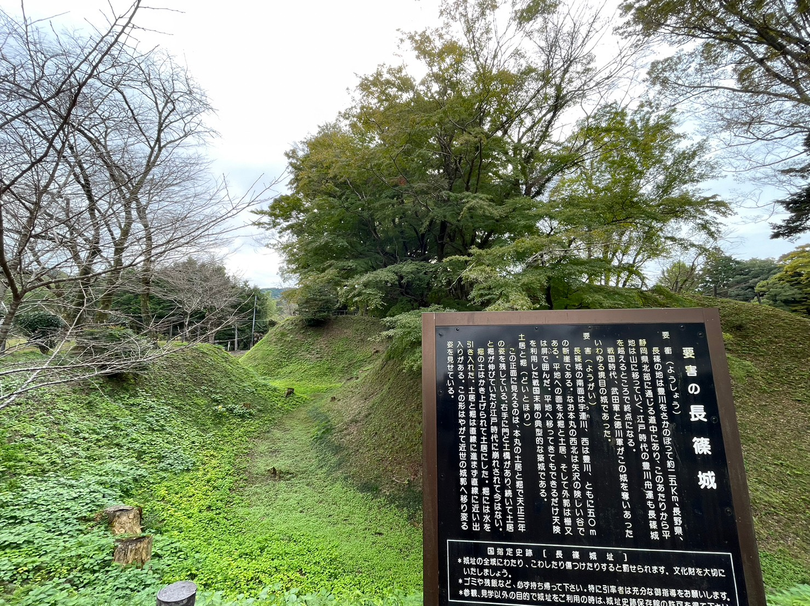
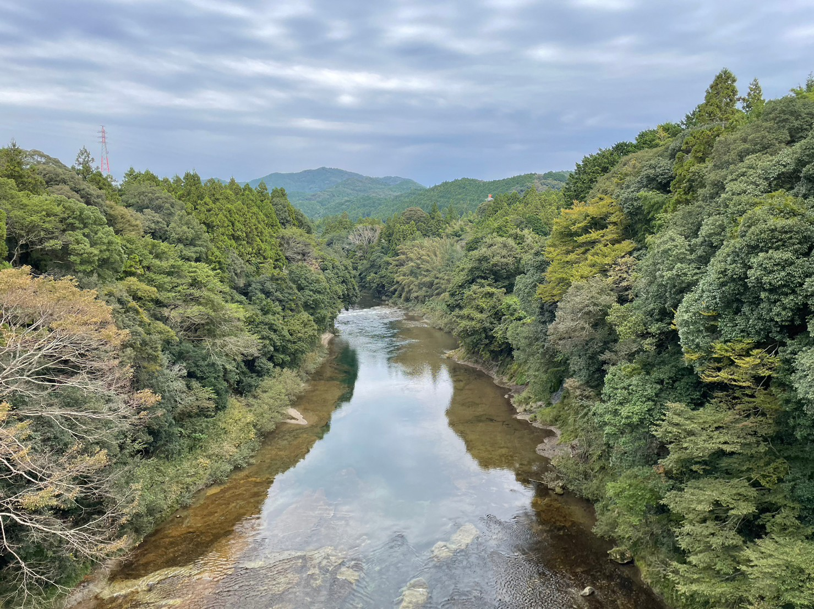
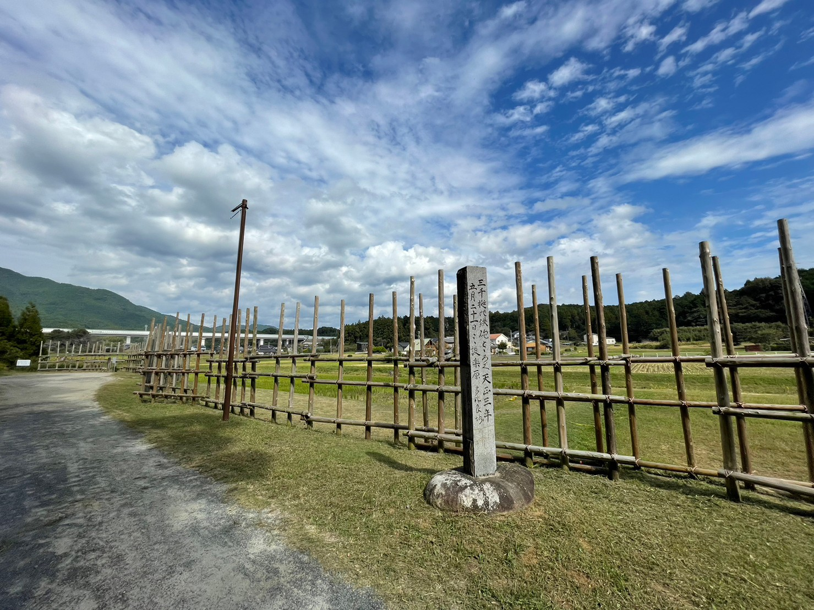
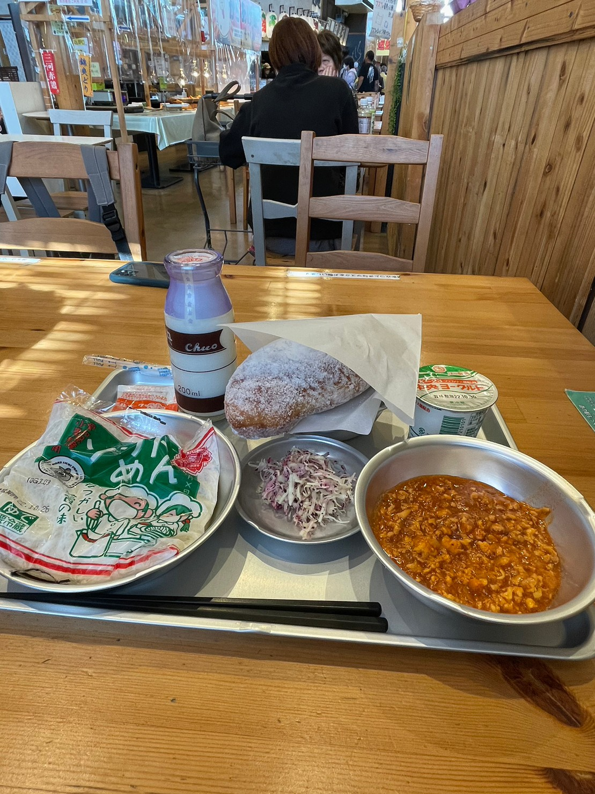
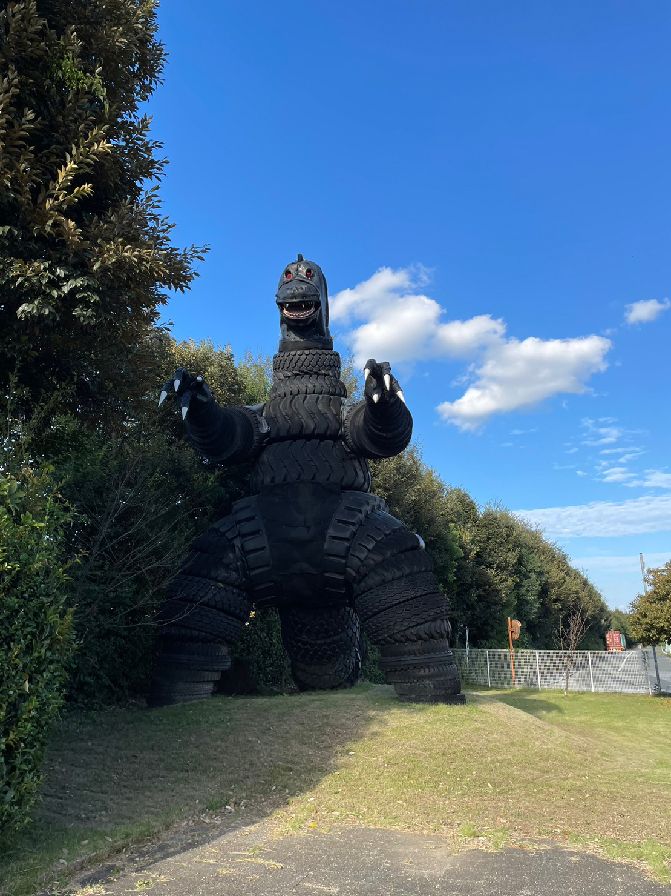
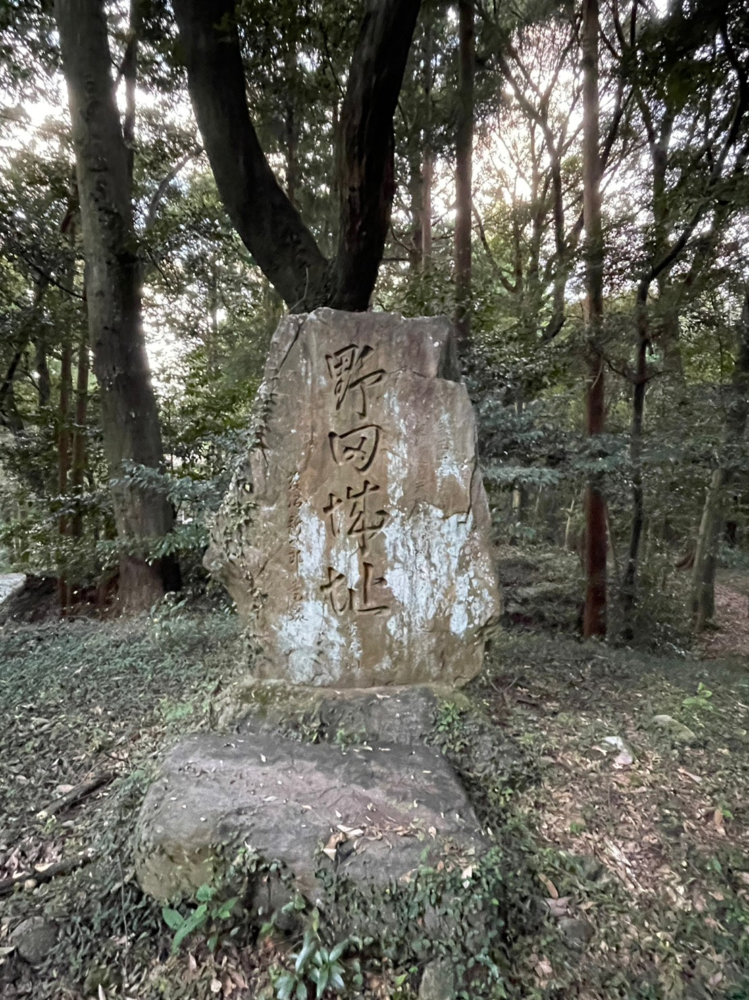
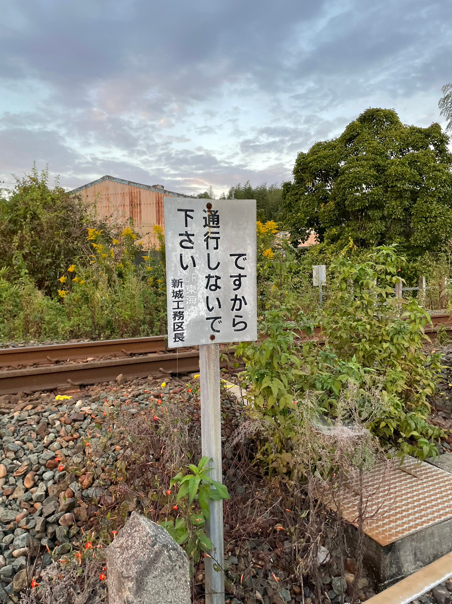

### 日時
2022年10月22日

### 目的地
- 長篠城
- 長篠城保存館
- 設楽原決戦場
- 設楽原歴史資料館
- 野田城
- 大野田城

### 収穫
- 百名城スタンプ 長篠城
- 御城印 長篠城
- 御城印 野田城
- 御城印 設楽原

### きっぷ
- 新城・本長篠往復きっぷ
- 往復・カルテットきっぷ専用新幹線変更券

### 金額
- 交通費 **2720円**
  - **1680円** 新城・本長篠往復きっぷ
  - **400円 x2** 新幹線変更券
  - **240円** 長篠城駅-野田城駅
- 食費 **2134円**
  - **418円** 朝ごはん(コンビニ)
  - **213円** クレープ(コンビニ)
  - **1000円** 昼ごはん(もっくる新城)
  - **203円** アイス(コンビニ)
  - **300円** アイス(新幹線)
- 入場料 **440円**
  - **440円** 長篠城保存館・設楽原歴史資料館共通
- 御城印 **900円**
  - **300円** 長篠城
  - **300円** 野田城
  - **300円** 設楽原
- お土産 **770円**
  - **770円** 五平餅

**合計 6964円**

### 移動
- **名古屋駅** [東海道新幹線]
- **豊橋駅** [JR 飯田線]
- **長篠城駅** [徒歩]
- **長篠城 / 長篠城保存館** [自転車]
- **設楽原歴史資料館** [自転車]
- **設楽原決戦場** [自転車]
- **もっくる新城** [自転車]
- **長篠城 / 長篠城保存館** [徒歩]
- **長篠城駅** [JR 飯田線]
- **野田城駅** [徒歩]
- **大野田城** [徒歩]
- **野田城** [徒歩]
- **東上駅** [JR 飯田線]
- **豊橋駅** [東海道新幹線]
- **名古屋駅**

### 感想
新幹線変更券によって 名古屋-豊橋間 を20分で移動することができて楽だった。

珍しくほぼ走らず、のんびりできた。

長篠城を守る川岸が急であれは攻めづらそうだった。

大野田城に行く途中で脱輪してる車があった。大学生っぽくて初心者マーク付けてた。
周りのじいさんばあさんと一緒に抜け出すのを助けた。めちゃおもろ

野田城の本丸の堀底から登ってみたが、足元の土が粘土質で滑って登れなかった。しかも崖も急で攻めづらそう。

### 写真
長篠城の堀

長篠城を守る豊川の断崖絶壁

設楽原決戦場の馬防柵

昼ごはんの給食セット

野田城駅付近にあった**ゴムラ**

野田城

東上駅付近の面白い看板
