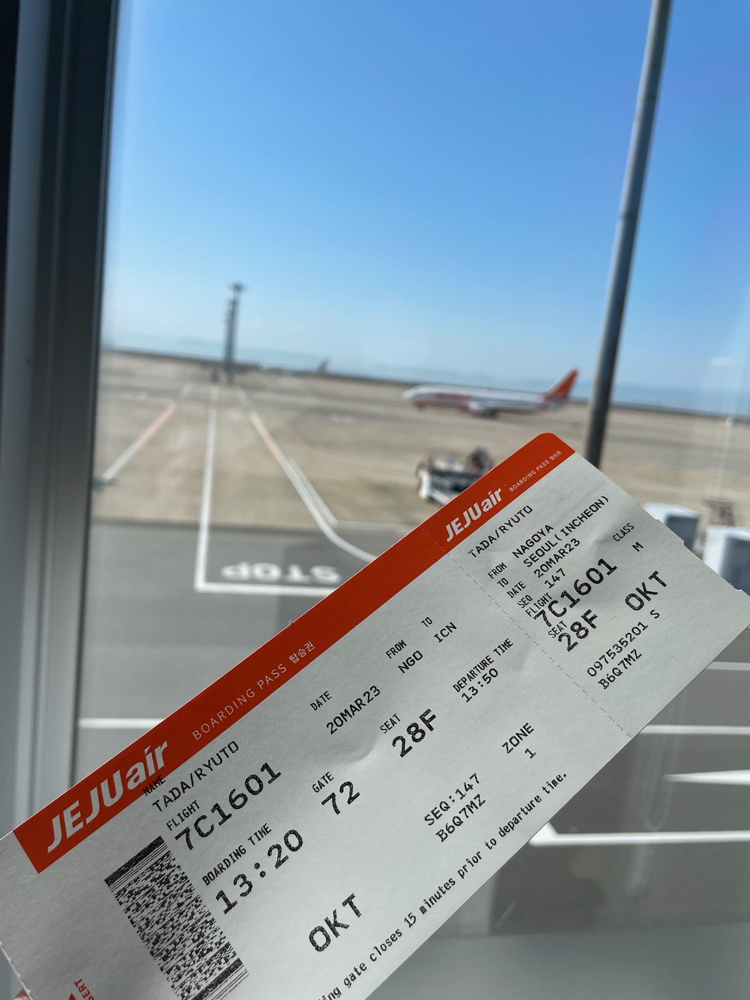
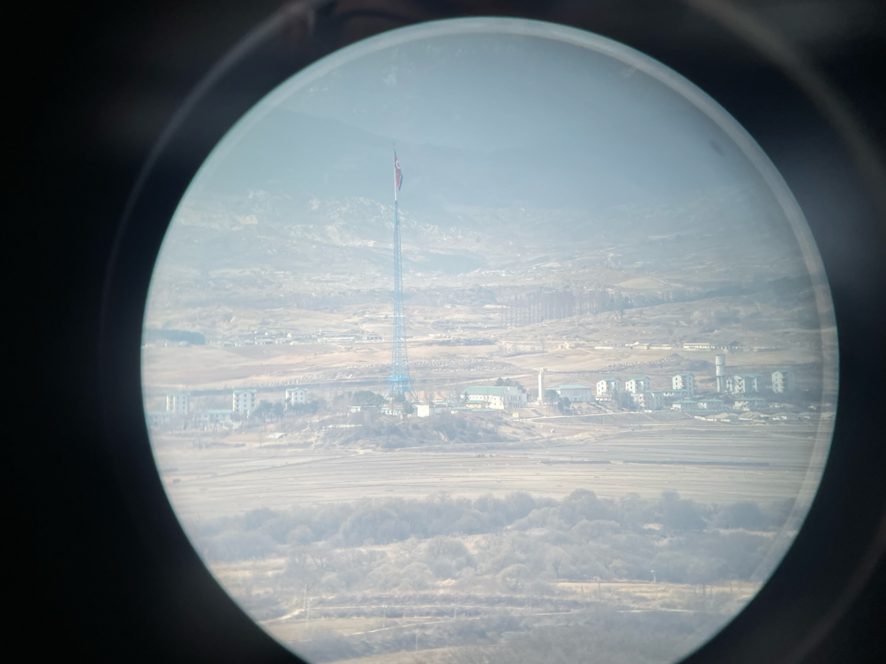
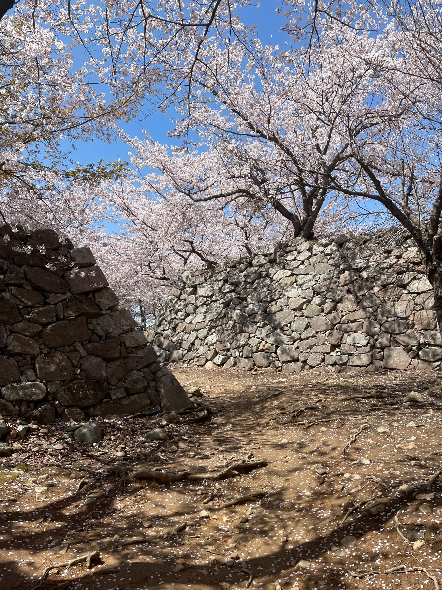
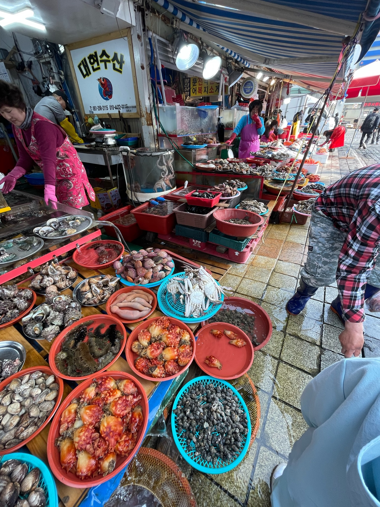

### 日時
2023年3月20日 ~ 30日

### 1日目
#### 予定
- 中部国際空港 -(jeju air)- 仁川国際空港
- 晩ごはん(鐘路3街)

#### 宿泊
- ヒュンダイレジデンス(ソウル)

### 2日目
#### 予定
- 城郭壁
- 東大門
- 梨泰院(イテウォン)
- 西大門刑務所
- 独立門
- 景福宮
- 晩ごはん(弘大入口)

#### 宿泊
- ヒュンダイレジデンス

### 3日目
- DMZ
  - 自由の橋
  - 第3トンネル
  - 都羅展望台
- 慶熙大学
- 教保文庫(本屋)
- 明洞

#### 宿泊
- ヒュンダイレジデンス

### 4日目
- 弘益大学
- 弘大通り
- ソウル駅 - 釜山駅
- 新世界デパート(釜山)
- ロッテデパート(釜山)
- ホームプラス(海雲台)
- 海雲台市場

#### 宿泊
- マリンシティ

### 5日目
- 腹痛
- 図書館

#### 宿泊
- マリンシティ

### 6日目
- 新世界デパート(釜山
- ロッテデパート(釜山)
- 昼飯(ムルミョン)

#### 宿泊
- 이모の家

### 7日目
- 西生浦倭城
- 蔚山倭城

#### 宿泊
- 이모の家

### 8日目
- 登山(金連山, 荒領山)
- 荒領山狼煙台
- 昼飯(ネンミョン)
- 時計買ったとこ
- じゃがいもチーズハッドク

#### 宿泊
- 이모の家

### 9日目
- 大覚寺
- 連山洞古墳群
- 国際市場

#### 宿泊
- 이모の家

### 10日目
- 釜山国際旅客ターミナル

#### 宿泊
- パンスターフェリー

### 11日目
- 大阪南港

### 感想
韓国は楽しいけど3日で疲れた。  
飯の量が多い！  
おかずが辛いものばっかり！

やはり名古屋が一番。

### 写真
JEJUair(セントレア)

都羅展望台(韓国)から見る北朝鮮

西生浦倭城

チャガルチ市場

