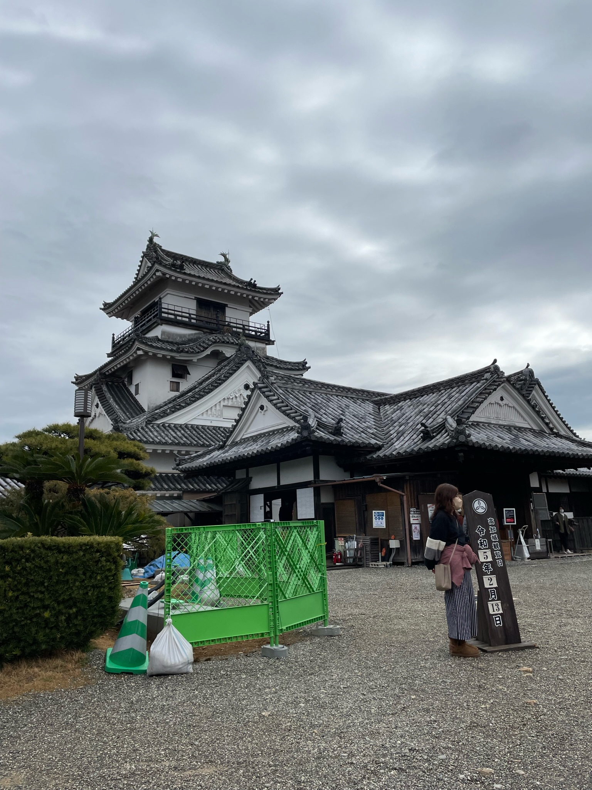
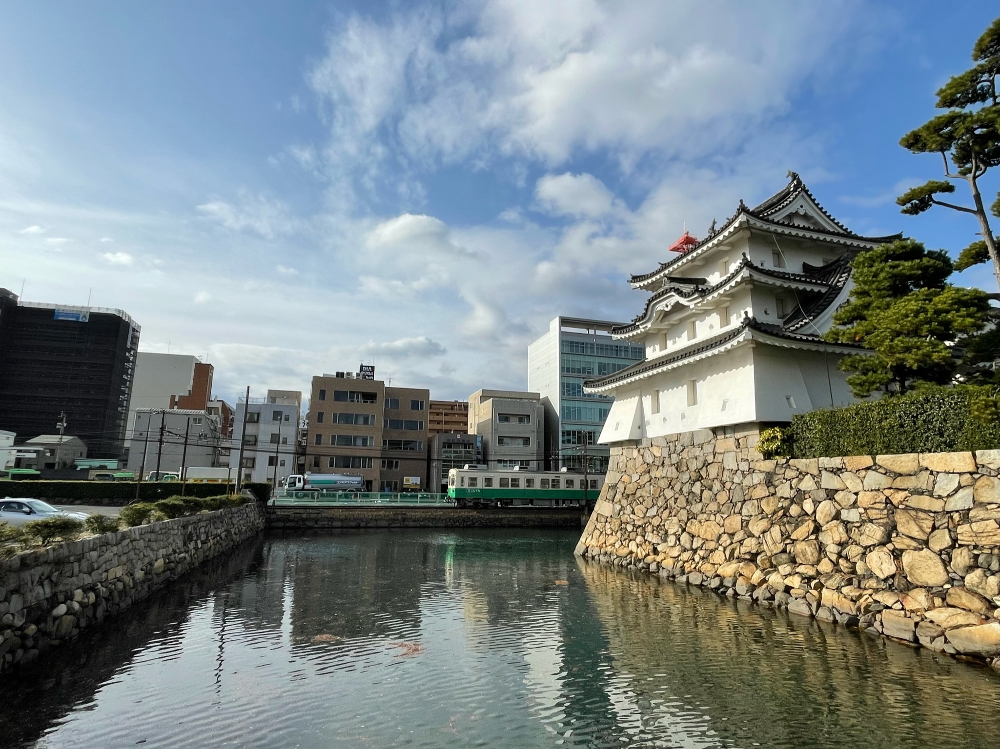

### 日時
2023年2月13日 ~ 15日

### 目的地
- 高知県
  - 岡豊城
  - 高知城
- 香川県
  - 丸亀城
  - 高松城
  - 引田城
- 徳島県
  - 勝瑞城
  - 一宮城
  - 徳島城

### 収穫
- 高知県
  - 岡豊城 続100名城スタンプ, 御城印
  - 高知城 100名城スタンプ, 御城印
- 香川県
  - 丸亀城 100名城スタンプ, 御城印
  - 高松城 100名城スタンプ, 御城印
  - 引田城 続100名城スタンプ, 御城印
- 徳島県
  - 勝瑞城 続100名城スタンプ, 御城印
  - 一宮城 続100名城スタンプ, 御城印
  - 徳島城 100名城スタンプ, 御城印

### 金額
- 1日目
  - **11900円** 小牧空港-高知空港
  - **2420円** 高知空港-岡豊城-高知駅 タクシー
  - **400円** コインロッカー 高知駅
  - **200円** 高知駅-高知城前 路面電車
  - **200円** 高知城 御城印
  - **650円** 鍋焼きラーメン
  - **3420円** 高知駅-丸亀駅 JR特急
  - **400円** コインロッカー 丸亀駅
  - **300円** 丸亀城 入城料
  - **200円** 丸亀城 御城印
  - **560円** 丸亀駅-高松駅 JR
  - **2000円** IRUCA
  - **230円** 肉うどん
  - **108円** 雪見だいふく
  - **398円** 焼きうどん
  - **2800円** 宿泊

**計 23386円**

- 2日目
  - **500** 高松城 入城料・御城印
  - **970** 高松駅-引田駅 乗車券
  - **1590** 高松駅-引田駅 特急券
  - **659** 引田駅-田の浦海岸 タクシー
  - **300** 引田城 御城印
  - **460** 引田駅-勝瑞駅 JR
  - **600** 勝瑞城 御城印
  - **238** からあげくん
  - **260** 勝瑞駅-府中駅 JR
  - **250** 府中-一の宮札所前 徳島バス
  - **300** 一宮城 御城印
  - **1690** タクシー
  - **310** 観音寺北-徳島駅前 徳島バス
  - **2660** ホテル
  - **650** ラーメン
  - **400** ぎょうざ
  - **450** 銭湯

**計 12287円**

- 3日目
  - **210円** 徳島駅-南海フェリー前 徳島市営バス
  - **2200円** 好きっぷ
  - **300円** 徳島 御船印
  - **650円** 徳島お土産
  - **230円** 和歌山港-岡山町 和歌山バス
  - **600円** 御城印 和歌山城x2
  - **1800円** 六文銭
  - **230円** 県庁前-南海和歌山市駅 和歌山バス
  - **1925円** お好み焼き
  - **180円** JR難波-ユニバーサルシティ
  - **160円** ユニバーサルシティ-西九条 大阪環状線
  - **210円** 西九条-大阪難波 阪神なんば線
  - **6380円** だるま

**計 6964円**

**合計 50738円**

### 計画
- 1日目
  - 小牧空港-(飛行機)-高知空港
  - 高知空港 -(タクシー)- 岡豊城
  - 岡豊山 -(とさでん交通バス)- 高知駅
  - 高知駅 -(チャリ)- 高知城
  - 高知城 -(チャリ)- 高知駅 
  - 高知駅 -(JR特急)- 丸亀駅
  - 丸亀駅 -(JR)- 高松駅

宿泊先：四国高松温泉ニューグランデみまつ

- 2日目
  - 高松城
  - 高松駅 -(JR特急)- 引田駅
  - 引田駅 -(徒歩)- 引田城
  - 引田城 -(徒歩)- 引田駅
  - 引田 -(JR高徳線)- 勝瑞
  - 勝瑞駅 -(徒歩)- 武田石油
  - 勝瑞城 -(徒歩)- 勝瑞駅
  - 勝瑞 -(JR鳴門線)- 府中
  - 府中 -(徳島バス)- 一の宮札所前
  - 一の宮札所前 -(徳島バス)- 徳島駅前

宿泊先：ビジネスホテル ネクセル秋田町

- 3日目
  - 徳島城
  - 徳島駅前 -(市営バス)- 南海フェリー前
  - 徳島港 -(南海フェリー)- 和歌山港
  - 和歌山港 -(和歌山バス)- 県庁前(和歌山城)
  - 県庁前(和歌山城) -(和歌山バス)- 南海和歌山市駅
  - 和歌山市駅 -(南海鉄道)- 難波駅
  - 難波駅 -(OsakaMetro, JR)- ユニバーサルシティ駅
  - ユニバーサルシティ駅 -(OsakaMetro, JR)- 難波駅
  - 大阪難波駅 -(近鉄ひのとり)- 名古屋駅

### 感想
タクシー最強。はやく免許とりてー  
のんびりした旅だった。最高  
30分ユニバはあほ

### 写真
高知城

高松城

